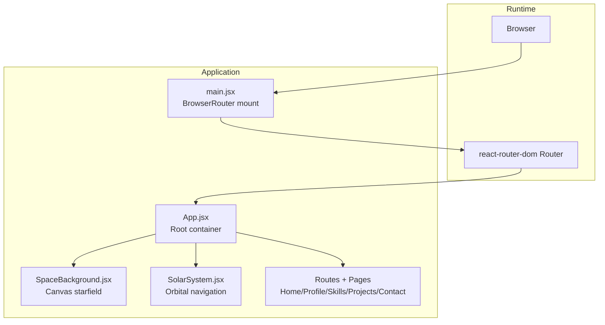
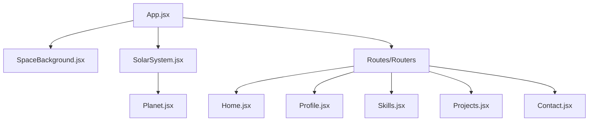
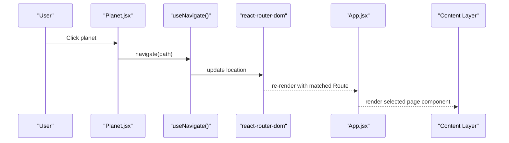
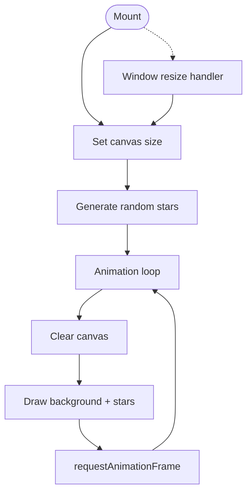
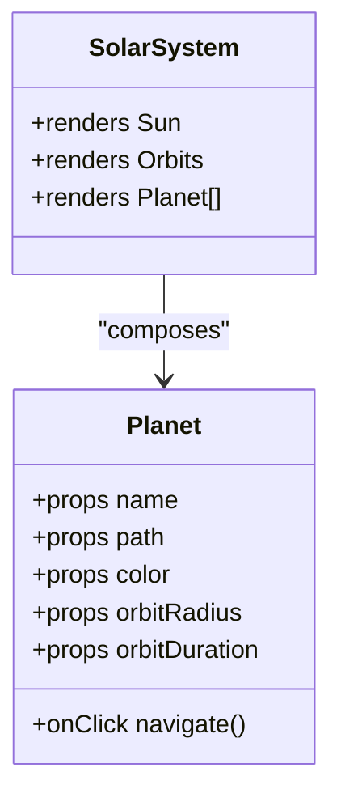
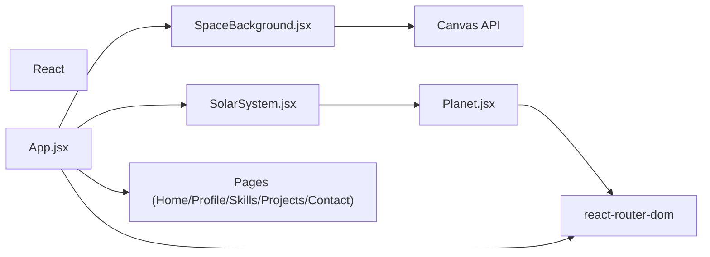

# Architecture & Design

<cite>
**Referenced Files in This Document**
- [App.jsx](file://src/App.jsx)
- [main.jsx](file://src/main.jsx)
- [SpaceBackground.jsx](file://src/components/SpaceBackground.jsx)
- [SolarSystem.jsx](file://src/components/SolarSystem.jsx)
- [Planet.jsx](file://src/components/Planet.jsx)
- [SpaceBackground.css](file://src/components/SpaceBackground.css)
- [SolarSystem.css](file://src/components/SolarSystem.css)
- [Planet.css](file://src/components/Planet.css)
- [App.css](file://src/App.css)
- [index.css](file://src/index.css)
- [Home.jsx](file://src/pages/Home.jsx)
- [Profile.jsx](file://src/pages/Profile.jsx)
- [Skills.jsx](file://src/pages/Skills.jsx)
- [Projects.jsx](file://src/pages/Projects.jsx)
- [Contact.jsx](file://src/pages/Contact.jsx)
</cite>

## Table of Contents
1. [Introduction](#introduction)
2. [Project Structure](#project-structure)
3. [Core Components](#core-components)
4. [Architecture Overview](#architecture-overview)
5. [Detailed Component Analysis](#detailed-component-analysis)
6. [Dependency Analysis](#dependency-analysis)
7. [Performance Considerations](#performance-considerations)
8. [Troubleshooting Guide](#troubleshooting-guide)
9. [Conclusion](#conclusion)

## Introduction
This document describes the architectural design of the Solar System Portfolio, a component-based React application. It emphasizes a layered presentation model:
- Background layer: SpaceBackground provides an animated starfield canvas.
- Navigation layer: SolarSystem renders an orbital navigation system around a central Sun.
- Content layer: Page components (Home, Profile, Skills, Projects, Contact) render the primary content.

The root component App.jsx orchestrates these layers and integrates routing via react-router-dom. The design leverages component composition, animation-driven navigation, and layered presentation to deliver an immersive, space-themed portfolio experience.

## Project Structure
The project follows a feature-based layout with clear separation between components, pages, and global styles:
- Root entry initializes the app with BrowserRouter and mounts App.
- App composes three primary layers: SpaceBackground, SolarSystem, and a content area with routes.
- Pages are organized under src/pages and styled independently.
- Shared components (SpaceBackground, SolarSystem, Planet) live under src/components with dedicated CSS.

**Diagram sources**
- [main.jsx](file://src/main.jsx#L1-L14)
- [App.jsx](file://src/App.jsx#L1-L35)

**Section sources**
- [main.jsx](file://src/main.jsx#L1-L14)
- [App.jsx](file://src/App.jsx#L1-L35)

## Core Components
This section documents the core building blocks and their roles in the layered architecture.

- App.jsx
  - Composes the three layers: SpaceBackground, SolarSystem, and a content area with Routes.
  - Defines route mappings for Home, Profile, Skills, Projects, and Contact.
  - Provides the content layer’s pointer-events policy to allow interaction with routed content while keeping background/navigation inert.

- SpaceBackground.jsx
  - Renders a full-screen canvas background.
  - Initializes and animates a starfield with twinkling effects using requestAnimationFrame.
  - Handles window resize to adjust canvas dimensions and star density.

- SolarSystem.jsx
  - Central Sun component with profile visuals and informational overlay.
  - Renders orbital paths and five Planet components with distinct orbital radii and durations.
  - Manages z-index and pointer-events to ensure interactive elements receive clicks.

- Planet.jsx
  - Individual planet component with click-to-navigate behavior.
  - Uses CSS animations to simulate orbital motion around the Sun.
  - Applies hover effects and labels for enhanced UX.

- Page Components (Home, Profile, Skills, Projects, Contact)
  - Each page is a self-contained component rendering its content.
  - Integrated via react-router Routes inside App.

- Global Styles
  - index.css resets and base styles.
  - App.css manages z-index and pointer-events for the content layer.
  - Component-specific CSS defines animations, responsive behavior, and visual themes.

**Section sources**
- [App.jsx](file://src/App.jsx#L11-L35)
- [SpaceBackground.jsx](file://src/components/SpaceBackground.jsx#L4-L68)
- [SolarSystem.jsx](file://src/components/SolarSystem.jsx#L4-L60)
- [Planet.jsx](file://src/components/Planet.jsx#L4-L34)
- [Home.jsx](file://src/pages/Home.jsx#L3-L25)
- [Profile.jsx](file://src/pages/Profile.jsx#L3-L54)
- [Skills.jsx](file://src/pages/Skills.jsx#L3-L52)
- [Projects.jsx](file://src/pages/Projects.jsx#L3-L66)
- [Contact.jsx](file://src/pages/Contact.jsx#L3-L74)
- [App.css](file://src/App.css#L1-L26)
- [index.css](file://src/index.css#L1-L40)

## Architecture Overview
The system employs a layered presentation pattern:
- Background layer (SpaceBackground): Fixed-position canvas with continuous animation.
- Navigation layer (SolarSystem): Fixed-position orbital system with interactive planets.
- Content layer (Page components): Relative-positioned content rendered by react-router.

**Diagram sources**
- [App.jsx](file://src/App.jsx#L11-L35)
- [SpaceBackground.jsx](file://src/components/SpaceBackground.jsx#L4-L68)
- [SolarSystem.jsx](file://src/components/SolarSystem.jsx#L4-L60)
- [Planet.jsx](file://src/components/Planet.jsx#L4-L34)
- [Home.jsx](file://src/pages/Home.jsx#L3-L25)
- [Profile.jsx](file://src/pages/Profile.jsx#L3-L54)
- [Skills.jsx](file://src/pages/Skills.jsx#L3-L52)
- [Projects.jsx](file://src/pages/Projects.jsx#L3-L66)
- [Contact.jsx](file://src/pages/Contact.jsx#L3-L74)

## Detailed Component Analysis

### App.jsx: Root Container and Routing Orchestrator
- Responsibilities
  - Hosts the background, navigation, and content layers.
  - Declares routes for all pages and ensures the content layer is interactive.
- Interaction Model
  - SpaceBackground runs independently of routing.
  - SolarSystem controls navigation via Planet clicks.
  - Content layer receives route updates from react-router and renders the selected page.

**Diagram sources**
- [Planet.jsx](file://src/components/Planet.jsx#L7-L9)
- [App.jsx](file://src/App.jsx#L22-L28)

**Section sources**
- [App.jsx](file://src/App.jsx#L11-L35)

### SpaceBackground.jsx: Animated Starfield Canvas
- Responsibilities
  - Initialize canvas to match viewport.
  - Generate randomized stars with varying opacity and twinkle speed.
  - Render a dark background and animate star twinkling.
  - Clean up event listeners and animation frames on unmount.
- Performance Notes
  - Star count scales with viewport area.
  - requestAnimationFrame used for smooth animation loop.

**Diagram sources**
- [SpaceBackground.jsx](file://src/components/SpaceBackground.jsx#L13-L62)

**Section sources**
- [SpaceBackground.jsx](file://src/components/SpaceBackground.jsx#L4-L68)
- [SpaceBackground.css](file://src/components/SpaceBackground.css#L1-L10)

### SolarSystem.jsx: Orbital Navigation System
- Responsibilities
  - Render the Sun at the center with profile visuals and glow.
  - Render orbital rings and Planet components with distinct orbital radii/durations.
  - Manage z-index and pointer-events so only interactive elements receive events.
- Design Pattern
  - Composition: Aggregates Sun, orbits, and Planet children.
  - Animation-driven navigation: Planets orbit the Sun; clicking navigates to associated routes.

**Diagram sources**
- [SolarSystem.jsx](file://src/components/SolarSystem.jsx#L4-L60)
- [Planet.jsx](file://src/components/Planet.jsx#L4-L34)

**Section sources**
- [SolarSystem.jsx](file://src/components/SolarSystem.jsx#L4-L60)
- [SolarSystem.css](file://src/components/SolarSystem.css#L1-L180)

### Planet.jsx: Interactive Orbital Destination
- Responsibilities
  - Apply orbital CSS animation keyed by orbitRadius and orbitDuration.
  - Trigger navigation on click using react-router’s useNavigate.
  - Provide hover feedback and label visibility.
- Communication
  - Receives route path from SolarSystem configuration.
  - Calls navigate to update browser location.

**Section sources**
- [Planet.jsx](file://src/components/Planet.jsx#L4-L34)
- [Planet.css](file://src/components/Planet.css#L1-L90)

### Page Components: Content Presentation
- Responsibilities
  - Present domain-specific content for each route.
  - Self-contained styling per page.
- Integration
  - Mounted by react-router when the matching path is active.

**Section sources**
- [Home.jsx](file://src/pages/Home.jsx#L3-L25)
- [Profile.jsx](file://src/pages/Profile.jsx#L3-L54)
- [Skills.jsx](file://src/pages/Skills.jsx#L3-L52)
- [Projects.jsx](file://src/pages/Projects.jsx#L3-L66)
- [Contact.jsx](file://src/pages/Contact.jsx#L3-L74)

## Dependency Analysis
- Runtime Dependencies
  - React and react-router-dom are used for component rendering and routing.
  - Canvas API is used by SpaceBackground for animation.
- Internal Dependencies
  - App depends on SpaceBackground, SolarSystem, and page components.
  - SolarSystem depends on Planet.
  - Planet depends on react-router-dom for navigation.
- CSS Dependencies
  - App.css and index.css provide base layout and pointer-events policies.
  - Component CSS files define animations and responsive behavior.

**Diagram sources**
- [App.jsx](file://src/App.jsx#L1-L10)
- [SolarSystem.jsx](file://src/components/SolarSystem.jsx#L1)
- [Planet.jsx](file://src/components/Planet.jsx#L1)
- [SpaceBackground.jsx](file://src/components/SpaceBackground.jsx#L1)

**Section sources**
- [App.jsx](file://src/App.jsx#L1-L10)
- [main.jsx](file://src/main.jsx#L1-L14)

## Performance Considerations
- Canvas Rendering
  - Star count scales with viewport area; consider culling or LOD for very large screens.
  - requestAnimationFrame ensures efficient animation; ensure cleanup on unmount.
- CSS Animations
  - Orbital animations are GPU-friendly; avoid excessive repaints by limiting DOM thrashing.
- Pointer Events
  - App.css and SolarSystem.css manage pointer-events to minimize event overhead.
- Routing
  - React Router lazy loading can be considered for larger applications; current inline imports are fine for small page set.

## Troubleshooting Guide
- Background Not Visible
  - Verify z-index stacking order and canvas sizing logic.
  - Confirm SpaceBackground.css applies fixed positioning and full coverage.
- Planets Not Clickable
  - Ensure pointer-events are enabled for interactive elements and disabled for orbits.
  - Check z-index ordering so planets are above orbits.
- Navigation Not Working
  - Confirm react-router is wrapped around App and useNavigate is invoked with correct path.
- Content Overlapped by Navigation
  - Adjust z-index and pointer-events in App.css and SolarSystem.css to separate layers.

**Section sources**
- [App.css](file://src/App.css#L1-L26)
- [SolarSystem.css](file://src/components/SolarSystem.css#L1-L180)
- [Planet.css](file://src/components/Planet.css#L1-L90)
- [SpaceBackground.css](file://src/components/SpaceBackground.css#L1-L10)

## Conclusion
The Solar System Portfolio demonstrates a clean, layered component architecture:
- SpaceBackground establishes an immersive, passive background.
- SolarSystem provides an animation-driven navigation layer with clear interactivity.
- Content layer delivers focused, page-specific experiences via routing.

This design separates concerns effectively: background systems remain isolated, navigation mechanics are encapsulated in SolarSystem and Planet, and content presentation is modularized into page components. The result is a cohesive, performant, and visually engaging portfolio experience.