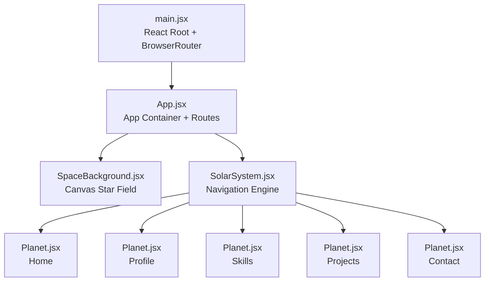
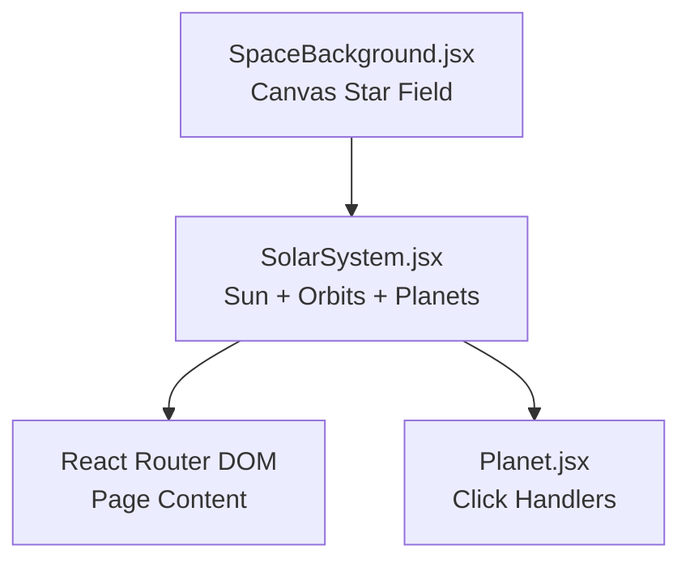
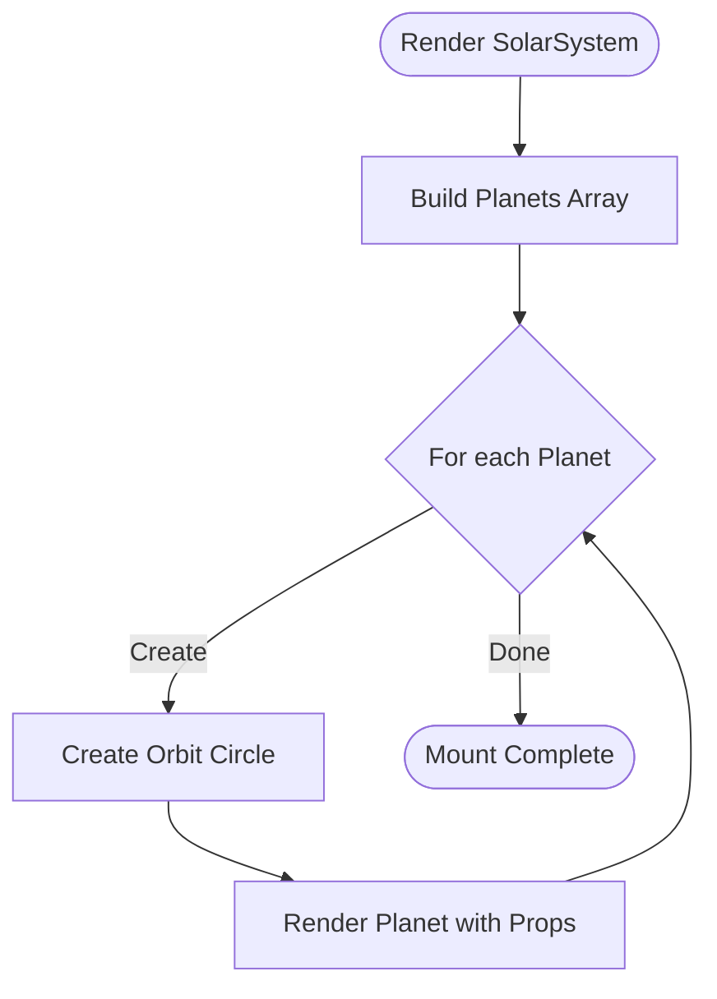
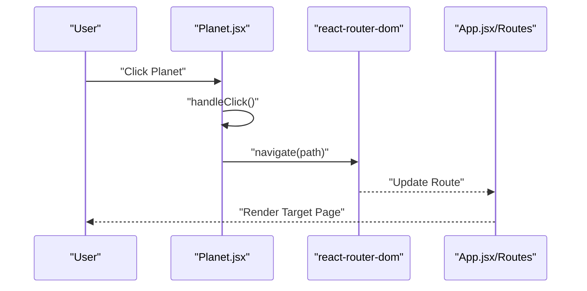
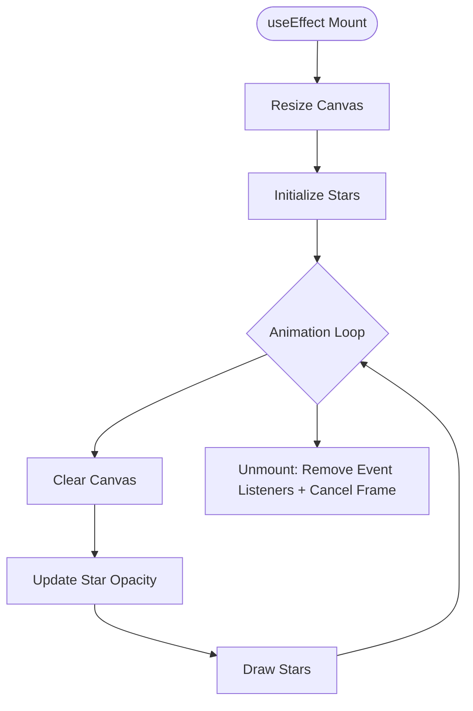
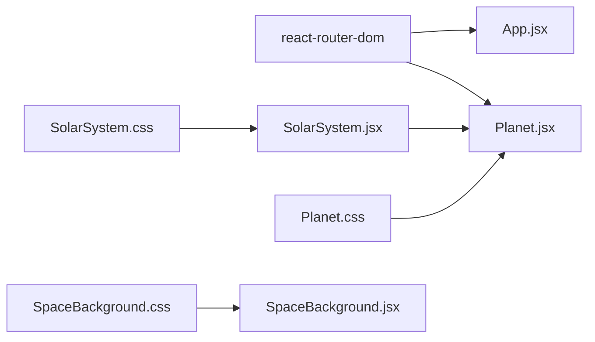

# Component System

<cite>
**Referenced Files in This Document**
- [SolarSystem.jsx](file://src/components/SolarSystem.jsx)
- [Planet.jsx](file://src/components/Planet.jsx)
- [SpaceBackground.jsx](file://src/components/SpaceBackground.jsx)
- [SolarSystem.css](file://src/components/SolarSystem.css)
- [Planet.css](file://src/components/Planet.css)
- [SpaceBackground.css](file://src/components/SpaceBackground.css)
- [App.jsx](file://src/App.jsx)
- [main.jsx](file://src/main.jsx)
</cite>

## Table of Contents
1. [Introduction](#introduction)
2. [Project Structure](#project-structure)
3. [Core Components](#core-components)
4. [Architecture Overview](#architecture-overview)
5. [Detailed Component Analysis](#detailed-component-analysis)
6. [Dependency Analysis](#dependency-analysis)
7. [Performance Considerations](#performance-considerations)
8. [Troubleshooting Guide](#troubleshooting-guide)
9. [Conclusion](#conclusion)

## Introduction
This document describes the component system powering the Solar System Portfolio. It focuses on three core components:
- SolarSystem: Central navigation engine that orchestrates orbital mechanics and page navigation.
- Planet: Interactive orbital bodies that respond to clicks and animate along elliptical paths.
- SpaceBackground: Canvas-based star field generator with performance optimizations and visual effects.

The documentation covers component responsibilities, props/state, lifecycle methods, inter-component communication, and customization options. It also provides usage examples and best practices for extending the system.

## Project Structure
The application initializes routing and composes the three core components:
- main.jsx sets up the React root and wraps the app in a router.
- App.jsx renders SpaceBackground (background), SolarSystem (navigation), and a content layer with routes.
- SolarSystem.jsx defines the central sun and five planets, passing configuration to Planet.
- Planet.jsx renders individual planets with orbital animations and click handlers.
- SpaceBackground.jsx creates a responsive star field using HTML5 Canvas.

**Diagram sources**
- [main.jsx](file://src/main.jsx#L1-L14)
- [App.jsx](file://src/App.jsx#L1-L35)
- [SolarSystem.jsx](file://src/components/SolarSystem.jsx#L1-L60)
- [Planet.jsx](file://src/components/Planet.jsx#L1-L34)
- [SpaceBackground.jsx](file://src/components/SpaceBackground.jsx#L1-L68)

**Section sources**
- [main.jsx](file://src/main.jsx#L1-L14)
- [App.jsx](file://src/App.jsx#L1-L35)

## Core Components
This section outlines the responsibilities, props, state, and behavior of each core component.

### SolarSystem
- Purpose: Central navigation engine that renders the sun and five planets. It defines orbital parameters and passes them to Planet instances.
- Props: None (reads internal configuration).
- State: None (manages configuration array internally).
- Lifecycle: Renders once during mount; no dynamic updates.
- Interactions:
  - Passes orbitRadius and orbitDuration to Planet to drive CSS keyframe animations.
  - Provides color and path for visual identity and navigation.
- Key behaviors:
  - Creates orbit circles sized by orbitRadius.
  - Renders the sun with glow and hover effects.
  - Uses pointer-events to allow interaction with child elements while keeping the container passive.

Customization options:
- Modify the planets array to change the number of destinations, colors, radii, and durations.
- Adjust the solar system container size and responsive breakpoints in SolarSystem.css.

Usage example:
- Import SolarSystem and render it alongside SpaceBackground in App.jsx.

**Section sources**
- [SolarSystem.jsx](file://src/components/SolarSystem.jsx#L1-L60)
- [SolarSystem.css](file://src/components/SolarSystem.css#L1-L180)

### Planet
- Purpose: Individual orbital body representing a destination page.
- Props:
  - name: Display label for the planet.
  - path: Target route for navigation.
  - color: Visual theme and glow color.
  - orbitRadius: Distance from the sun in pixels.
  - orbitDuration: Orbital period in seconds.
- State: None (uses props for rendering).
- Lifecycle: Renders once per mount; relies on CSS animations for motion.
- Interactions:
  - Click handler triggers navigation via react-router-dom’s useNavigate.
  - Hover effects scale the planet and reveal a label tooltip.
- Key behaviors:
  - Applies a CSS keyframe animation named orbit to rotate around the sun.
  - Uses CSS custom properties to pass orbitRadius to the animation.
  - Emits a soft glow using box-shadow with alpha-modulated colors.

Customization options:
- Change color for theming.
- Adjust orbitRadius and orbitDuration to alter orbital mechanics.
- Tweak hover scaling and label styles in Planet.css.

Usage example:
- Render Planet inside SolarSystem with the desired props.

**Section sources**
- [Planet.jsx](file://src/components/Planet.jsx#L1-L34)
- [Planet.css](file://src/components/Planet.css#L1-L90)

### SpaceBackground
- Purpose: Fullscreen canvas-based star field with twinkling stars and responsive resizing.
- Props: None.
- State: None (uses refs and effect hooks).
- Lifecycle:
  - Initializes canvas size on mount and resizes on window resize.
  - Creates a star array proportional to screen area.
  - Runs a continuous animation loop using requestAnimationFrame.
  - Cleans up event listeners and animation frames on unmount.
- Interactions:
  - No user interactions; purely visual.
- Key behaviors:
  - Clears the canvas with a dark blue gradient each frame.
  - Draws stars with randomized positions, sizes, opacities, and twinkling speeds.
  - Smoothly oscillates opacity to simulate twinkling.

Customization options:
- Adjust star count density by tuning the formula that computes numberOfStars.
- Modify background gradient colors in SpaceBackground.css.
- Change twinkling speed range by adjusting twinkleSpeed generation.

Usage example:
- Render SpaceBackground at the bottom layer behind SolarSystem and page content.

**Section sources**
- [SpaceBackground.jsx](file://src/components/SpaceBackground.jsx#L1-L68)
- [SpaceBackground.css](file://src/components/SpaceBackground.css#L1-L10)

## Architecture Overview
The system follows a layered composition:
- Background layer: SpaceBackground provides the starry backdrop.
- Navigation layer: SolarSystem hosts the sun and planets.
- Content layer: React Router renders page content on top of the navigation layer.

**Diagram sources**
- [App.jsx](file://src/App.jsx#L1-L35)
- [SolarSystem.jsx](file://src/components/SolarSystem.jsx#L1-L60)
- [Planet.jsx](file://src/components/Planet.jsx#L1-L34)
- [SpaceBackground.jsx](file://src/components/SpaceBackground.jsx#L1-L68)

## Detailed Component Analysis

### SolarSystem Component Analysis
- Responsibilities:
  - Define orbital configuration for each destination.
  - Render the sun with profile and glow.
  - Render orbit circles and Planet instances.
- Implementation highlights:
  - Iterates over a planets array to create orbit containers and Planet components.
  - Computes orbit dimensions from orbitRadius.
  - Passes color, path, orbitRadius, and orbitDuration to Planet.
- Physics-based animation parameters:
  - orbitRadius controls orbital distance.
  - orbitDuration controls orbital period.
  - CSS keyframes define the orbital motion.

**Diagram sources**
- [SolarSystem.jsx](file://src/components/SolarSystem.jsx#L4-L57)

**Section sources**
- [SolarSystem.jsx](file://src/components/SolarSystem.jsx#L1-L60)
- [SolarSystem.css](file://src/components/SolarSystem.css#L95-L116)

### Planet Component Analysis
- Responsibilities:
  - Render a clickable, glowing planet.
  - Animate along an orbital path using CSS keyframes.
  - Navigate to the configured route on click.
- Implementation highlights:
  - Uses useNavigate for programmatic navigation.
  - Applies CSS animation with custom property for radius.
  - Adds hover effects and label tooltip.
- Interaction flow:

**Diagram sources**
- [Planet.jsx](file://src/components/Planet.jsx#L7-L9)
- [App.jsx](file://src/App.jsx#L22-L28)

**Section sources**
- [Planet.jsx](file://src/components/Planet.jsx#L1-L34)
- [Planet.css](file://src/components/Planet.css#L51-L59)

### SpaceBackground Component Analysis
- Responsibilities:
  - Initialize canvas and handle resize events.
  - Generate and animate a star field.
- Implementation highlights:
  - Uses useEffect to set up canvas, resize handler, and animation loop.
  - Generates stars proportional to screen area for performance.
  - Twinkles stars by oscillating opacity with random speeds.
- Performance optimizations:
  - Limits star count to screen area divided by a constant.
  - Uses requestAnimationFrame for smooth animation.
  - Clears the canvas with a single fillRect each frame.

**Diagram sources**
- [SpaceBackground.jsx](file://src/components/SpaceBackground.jsx#L7-L62)

**Section sources**
- [SpaceBackground.jsx](file://src/components/SpaceBackground.jsx#L1-L68)
- [SpaceBackground.css](file://src/components/SpaceBackground.css#L1-L10)

## Dependency Analysis
- Runtime dependencies:
  - React Router DOM: Used by Planet for navigation and by App for page routing.
  - React: Hooks (useEffect, useRef, useNavigate) used across components.
- Component dependencies:
  - SolarSystem depends on Planet and CSS for layout and animations.
  - Planet depends on CSS for animations and styling.
  - SpaceBackground depends on CSS for base canvas positioning and background.

**Diagram sources**
- [Planet.jsx](file://src/components/Planet.jsx#L1)
- [SolarSystem.jsx](file://src/components/SolarSystem.jsx#L1)
- [SpaceBackground.jsx](file://src/components/SpaceBackground.jsx#L1)
- [App.jsx](file://src/App.jsx#L1-L35)

**Section sources**
- [Planet.jsx](file://src/components/Planet.jsx#L1)
- [SolarSystem.jsx](file://src/components/SolarSystem.jsx#L1)
- [SpaceBackground.jsx](file://src/components/SpaceBackground.jsx#L1)
- [App.jsx](file://src/App.jsx#L1-L35)

## Performance Considerations
- SolarSystem:
  - Uses CSS keyframes for orbital animation, avoiding JavaScript-driven transforms for smoothness.
  - Keeps pointer-events configuration to minimize event overhead.
- Planet:
  - Relies on CSS animations and transitions for hover effects.
  - Avoids heavy computations in render; props drive behavior.
- SpaceBackground:
  - Star count scales with screen area to balance visual density and performance.
  - requestAnimationFrame ensures efficient animation loops.
  - Clears the canvas with a single operation per frame.

[No sources needed since this section provides general guidance]

## Troubleshooting Guide
- Sun image fallback:
  - If the profile image fails to load, a fallback SVG is rendered. Verify asset path and network availability.
- Navigation not working:
  - Ensure react-router-dom is installed and BrowserRouter wraps the app. Confirm routes exist for each Planet path.
- Canvas not filling viewport:
  - On resize, the canvas resizes automatically. If not, check for CSS conflicts with fixed positioning or z-index stacking.
- Overlapping interactions:
  - SolarSystem sets pointer-events on children to allow interaction while keeping the container passive. If clicks do not register, verify CSS stacking order and z-index.

**Section sources**
- [SolarSystem.jsx](file://src/components/SolarSystem.jsx#L20-L27)
- [App.jsx](file://src/App.jsx#L1-L35)
- [SpaceBackground.jsx](file://src/components/SpaceBackground.jsx#L13-L17)

## Conclusion
The Solar System Portfolio’s component system combines a visually engaging starry background with a navigable orbital interface. SolarSystem orchestrates the sun and planets, Planet encapsulates interactive orbital behavior and navigation, and SpaceBackground delivers a performant star field. Together, they form a cohesive, extensible system suitable for portfolio navigation with room for customization and enhancement.