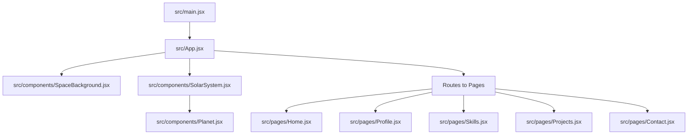
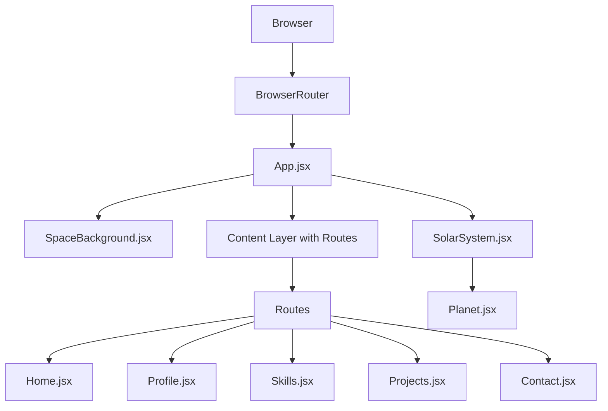
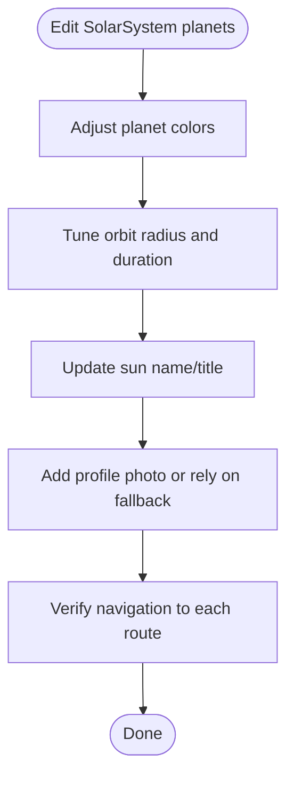
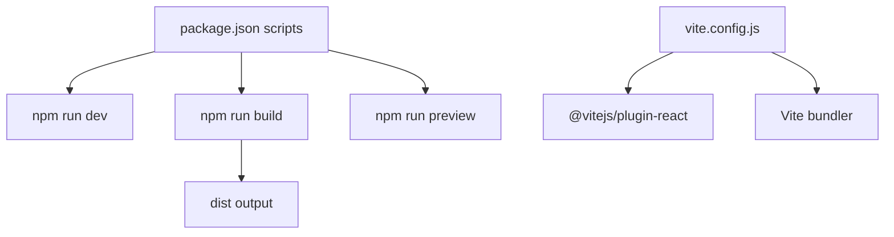

# Customization & Deployment

<cite>
**Referenced Files in This Document**
- [README.md](file://README.md)
- [package.json](file://package.json)
- [vite.config.js](file://vite.config.js)
- [vercel.json](file://vercel.json)
- [index.html](file://index.html)
- [src/main.jsx](file://src/main.jsx)
- [src/App.jsx](file://src/App.jsx)
- [src/components/SolarSystem.jsx](file://src/components/SolarSystem.jsx)
- [src/components/Planet.jsx](file://src/components/Planet.jsx)
- [src/components/SpaceBackground.jsx](file://src/components/SpaceBackground.jsx)
- [src/pages/Home.jsx](file://src/pages/Home.jsx)
- [src/pages/Profile.jsx](file://src/pages/Profile.jsx)
- [src/pages/Skills.jsx](file://src/pages/Skills.jsx)
- [src/pages/Projects.jsx](file://src/pages/Projects.jsx)
- [src/pages/Contact.jsx](file://src/pages/Contact.jsx)
</cite>

## Table of Contents
1. [Introduction](#introduction)
2. [Project Structure](#project-structure)
3. [Core Components](#core-components)
4. [Architecture Overview](#architecture-overview)
5. [Detailed Component Analysis](#detailed-component-analysis)
6. [Dependency Analysis](#dependency-analysis)
7. [Performance Considerations](#performance-considerations)
8. [Troubleshooting Guide](#troubleshooting-guide)
9. [Conclusion](#conclusion)
10. [Appendices](#appendices)

## Introduction
This document provides comprehensive guidance for customizing and deploying the Solar System Portfolio. It covers updating personal information across Profile, Skills, Projects, and Contact pages; adding a custom profile photo; and modifying planet colors and orbital parameters. It also explains deployment to Vercel, Netlify, and GitHub Pages, including build optimization and performance considerations, configuration options in vite.config.js and vercel.json, environment variables, and production build processes. Finally, it includes troubleshooting tips and best practices for maintaining the portfolio.

## Project Structure
The project follows a React + Vite setup with a clear separation of concerns:
- Entry point initializes routing and renders the main application.
- App composes the space background, solar system navigation, and page routes.
- SolarSystem defines the central sun and orbiting planets, each linking to a page route.
- Pages implement the content for Home, Profile, Skills, Projects, and Contact.
- Components encapsulate reusable UI elements such as Planet and SpaceBackground.

**Diagram sources**
- [src/main.jsx](file://src/main.jsx#L1-L14)
- [src/App.jsx](file://src/App.jsx#L1-L35)
- [src/components/SolarSystem.jsx](file://src/components/SolarSystem.jsx#L1-L60)
- [src/components/Planet.jsx](file://src/components/Planet.jsx#L1-L34)
- [src/components/SpaceBackground.jsx](file://src/components/SpaceBackground.jsx#L1-L68)
- [src/pages/Home.jsx](file://src/pages/Home.jsx#L1-L26)
- [src/pages/Profile.jsx](file://src/pages/Profile.jsx#L1-L72)
- [src/pages/Skills.jsx](file://src/pages/Skills.jsx#L1-L52)
- [src/pages/Projects.jsx](file://src/pages/Projects.jsx#L1-L66)
- [src/pages/Contact.jsx](file://src/pages/Contact.jsx#L1-L74)

**Section sources**
- [README.md](file://README.md#L70-L88)
- [src/main.jsx](file://src/main.jsx#L1-L14)
- [src/App.jsx](file://src/App.jsx#L1-L35)

## Core Components
- SolarSystem: Defines the sun and five orbiting planets. Planet metadata includes name, path, color, orbit radius, and orbit duration. The sun displays a profile photo with a fallback SVG if none is found.
- Planet: Renders a clickable planet that navigates to its associated route.
- SpaceBackground: Renders a responsive starfield with twinkling animations using Canvas.
- Pages: Home, Profile, Skills, Projects, and Contact implement page-specific content and styling.

Key customization touchpoints:
- Personal info and titles: update in SolarSystem (sun’s name/title) and Home hero content.
- Profile content: edit Profile page content.
- Skills content: edit Skills page categories and items.
- Projects content: edit Projects page entries.
- Contact links: edit Contact page links and icons.
- Profile photo: place image at the asset path referenced by SolarSystem.
- Planet colors and orbital parameters: edit SolarSystem’s planets array.

**Section sources**
- [src/components/SolarSystem.jsx](file://src/components/SolarSystem.jsx#L4-L11)
- [src/components/SolarSystem.jsx](file://src/components/SolarSystem.jsx#L19-L33)
- [src/components/Planet.jsx](file://src/components/Planet.jsx#L4-L26)
- [src/components/SpaceBackground.jsx](file://src/components/SpaceBackground.jsx#L4-L68)
- [src/pages/Home.jsx](file://src/pages/Home.jsx#L7-L18)
- [src/pages/Profile.jsx](file://src/pages/Profile.jsx#L9-L65)
- [src/pages/Skills.jsx](file://src/pages/Skills.jsx#L4-L21)
- [src/pages/Projects.jsx](file://src/pages/Projects.jsx#L4-L35)
- [src/pages/Contact.jsx](file://src/pages/Contact.jsx#L12-L60)
- [README.md](file://README.md#L48-L74)

## Architecture Overview
The runtime architecture integrates routing, rendering, and interactive elements:
- Routing: BrowserRouter wraps the App, which defines routes to Home, Profile, Skills, Projects, and Contact.
- Rendering: App composes SpaceBackground and SolarSystem beneath the content layer containing Routes.
- Interactivity: Planet components trigger navigation via React Router.

**Diagram sources**
- [src/main.jsx](file://src/main.jsx#L1-L14)
- [src/App.jsx](file://src/App.jsx#L1-L35)
- [src/components/SpaceBackground.jsx](file://src/components/SpaceBackground.jsx#L1-L68)
- [src/components/SolarSystem.jsx](file://src/components/SolarSystem.jsx#L1-L60)
- [src/components/Planet.jsx](file://src/components/Planet.jsx#L1-L34)
- [src/pages/Home.jsx](file://src/pages/Home.jsx#L1-L26)
- [src/pages/Profile.jsx](file://src/pages/Profile.jsx#L1-L72)
- [src/pages/Skills.jsx](file://src/pages/Skills.jsx#L1-L52)
- [src/pages/Projects.jsx](file://src/pages/Projects.jsx#L1-L66)
- [src/pages/Contact.jsx](file://src/pages/Contact.jsx#L1-L74)

## Detailed Component Analysis

### SolarSystem and Planet Customization
- Planet metadata: Modify colors, orbit radii, and durations to visually adjust orbital parameters.
- Sun profile: Update the sun’s name and title; ensure the profile photo path exists or rely on the fallback.
- Navigation: Planet clicks navigate to their respective routes.

**Diagram sources**
- [src/components/SolarSystem.jsx](file://src/components/SolarSystem.jsx#L4-L11)
- [src/components/SolarSystem.jsx](file://src/components/SolarSystem.jsx#L19-L33)
- [src/components/Planet.jsx](file://src/components/Planet.jsx#L4-L26)

**Section sources**
- [src/components/SolarSystem.jsx](file://src/components/SolarSystem.jsx#L4-L11)
- [src/components/SolarSystem.jsx](file://src/components/SolarSystem.jsx#L19-L33)
- [src/components/Planet.jsx](file://src/components/Planet.jsx#L4-L26)

### Profile Page Customization
- Replace placeholder content with your biography, education, experiences, and roles.
- Maintain semantic structure for readability and accessibility.

**Section sources**
- [src/pages/Profile.jsx](file://src/pages/Profile.jsx#L9-L65)

### Skills Page Customization
- Update categories and skills to reflect your expertise.
- Keep lists concise and relevant.

**Section sources**
- [src/pages/Skills.jsx](file://src/pages/Skills.jsx#L4-L21)

### Projects Page Customization
- Add or modify project entries with titles, descriptions, and technology tags.
- Ensure each project entry is consistent in structure.

**Section sources**
- [src/pages/Projects.jsx](file://src/pages/Projects.jsx#L4-L35)

### Contact Page Customization
- Update contact links and icons to point to your actual profiles.
- Keep CTAs clear and actionable.

**Section sources**
- [src/pages/Contact.jsx](file://src/pages/Contact.jsx#L12-L60)

### SpaceBackground Animation
- Canvas-based starfield with dynamic twinkling and responsive resizing.
- No customization required unless you want to alter star count density or animation behavior.

**Section sources**
- [src/components/SpaceBackground.jsx](file://src/components/SpaceBackground.jsx#L4-L68)

### Home Hero Content
- Update hero title, subtitle, and description to reflect your identity and value proposition.

**Section sources**
- [src/pages/Home.jsx](file://src/pages/Home.jsx#L7-L18)

## Dependency Analysis
- Runtime dependencies include React, React Router DOM, and React DOM.
- Build-time dependency is Vite with @vitejs/plugin-react.
- Scripts define development, build, and preview commands.

**Diagram sources**
- [package.json](file://package.json#L6-L10)
- [vite.config.js](file://vite.config.js#L1-L8)

**Section sources**
- [package.json](file://package.json#L15-L21)
- [package.json](file://package.json#L6-L10)
- [vite.config.js](file://vite.config.js#L1-L8)

## Performance Considerations
- Minimize heavy computations in render loops; the starfield uses efficient per-frame drawing and throttles star counts by viewport area.
- Keep images optimized; the profile photo path should point to a compressed JPEG/PNG.
- Prefer CSS animations for smooth transitions; the Orbit and glow effects are handled via CSS variables and animations.
- Use Vite’s built-in minification and asset handling in production builds.

[No sources needed since this section provides general guidance]

## Troubleshooting Guide
Common customization issues:
- Profile photo not appearing:
  - Ensure the asset path matches the expected location and filename.
  - Confirm the fallback SVG is rendered when the image fails to load.
- Planet navigation not working:
  - Verify route paths match between SolarSystem and App routes.
- Out-of-sync content after editing:
  - Confirm edits are saved and the development server is refreshed.

Deployment issues:
- Vercel:
  - Ensure build command, output directory, dev command, and install command align with project scripts.
- Netlify:
  - Deploy the dist folder generated by the build script.
- GitHub Pages:
  - Use the gh-pages package and configure the base directory appropriately.

Environment variables:
- None are currently defined in the repository; if needed, set them locally during development and pass them to Vite via the environment variable prefix convention.

Build and preview:
- Run the build script to generate the production bundle.
- Use the preview script to test the production build locally.

**Section sources**
- [src/components/SolarSystem.jsx](file://src/components/SolarSystem.jsx#L19-L27)
- [src/App.jsx](file://src/App.jsx#L22-L28)
- [vercel.json](file://vercel.json#L1-L7)
- [README.md](file://README.md#L90-L97)
- [package.json](file://package.json#L6-L10)

## Conclusion
By following this guide, you can fully customize your Solar System Portfolio with personal information, visuals, and orbital characteristics, then deploy it efficiently to Vercel, Netlify, or GitHub Pages. Use the provided configuration files and scripts to streamline builds and previews, and apply the troubleshooting tips to resolve common issues quickly.

[No sources needed since this section summarizes without analyzing specific files]

## Appendices

### A. Customization Checklist
- Update sun name/title and profile photo.
- Edit Profile, Skills, Projects, and Contact content.
- Adjust planet colors and orbital parameters.
- Verify navigation across all routes.
- Test responsiveness and animations.

**Section sources**
- [src/components/SolarSystem.jsx](file://src/components/SolarSystem.jsx#L19-L33)
- [src/pages/Profile.jsx](file://src/pages/Profile.jsx#L9-L65)
- [src/pages/Skills.jsx](file://src/pages/Skills.jsx#L4-L21)
- [src/pages/Projects.jsx](file://src/pages/Projects.jsx#L4-L35)
- [src/pages/Contact.jsx](file://src/pages/Contact.jsx#L12-L60)
- [src/components/SolarSystem.jsx](file://src/components/SolarSystem.jsx#L4-L11)

### B. Deployment Commands and Configuration
- Build: npm run build
- Preview: npm run preview
- Vercel configuration: vercel.json
- Base URL and public assets: index.html sets the root div and favicon reference.

**Section sources**
- [package.json](file://package.json#L6-L10)
- [vercel.json](file://vercel.json#L1-L7)
- [index.html](file://index.html#L1-L14)