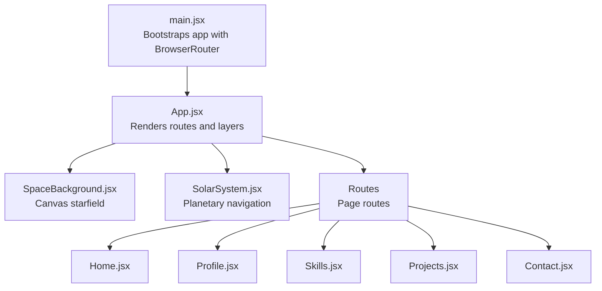
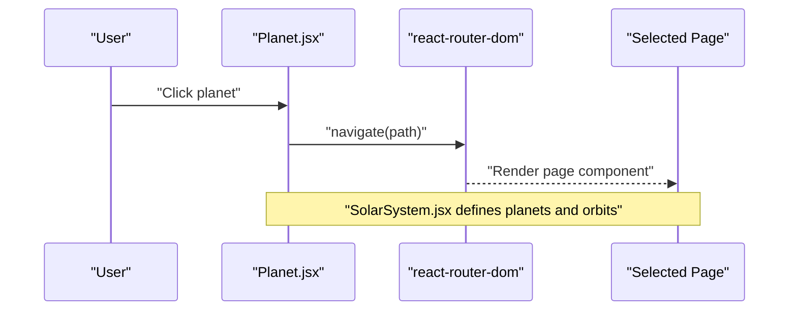
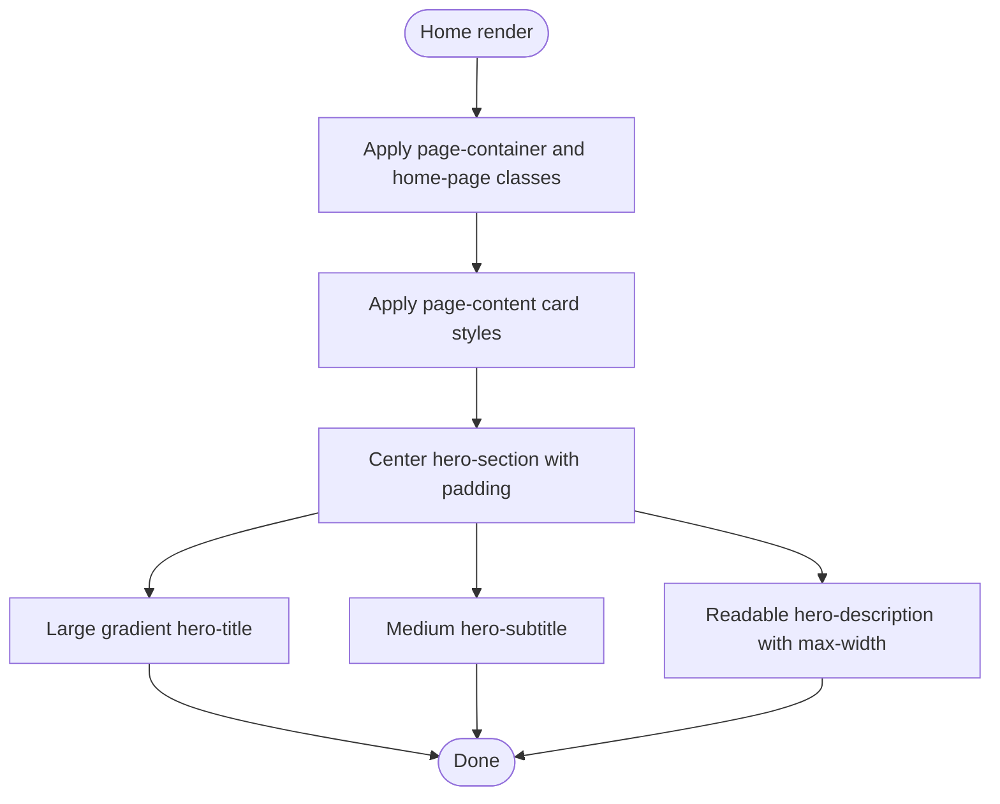
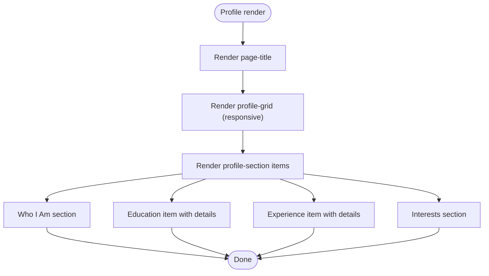
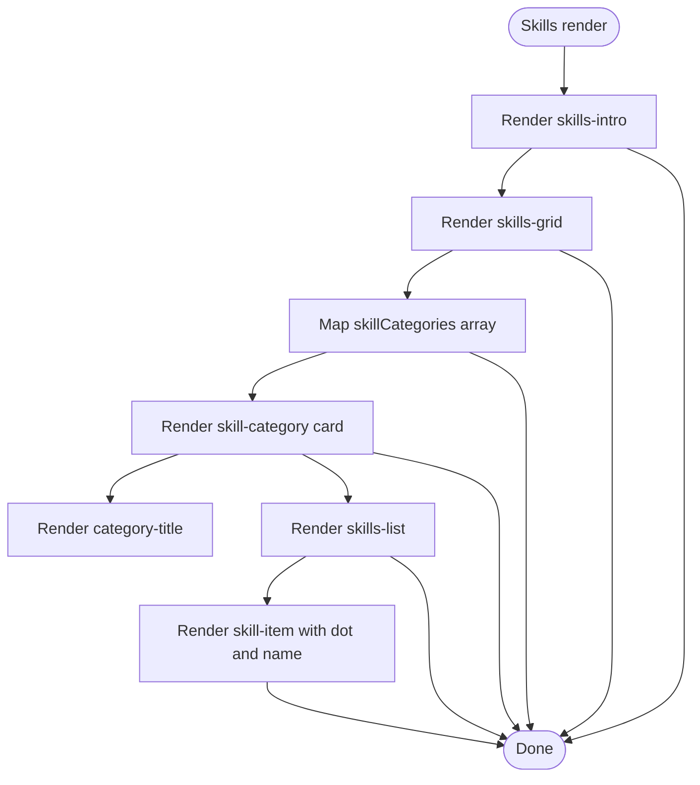
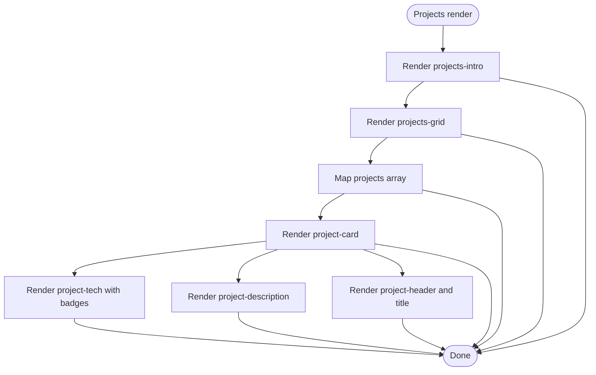
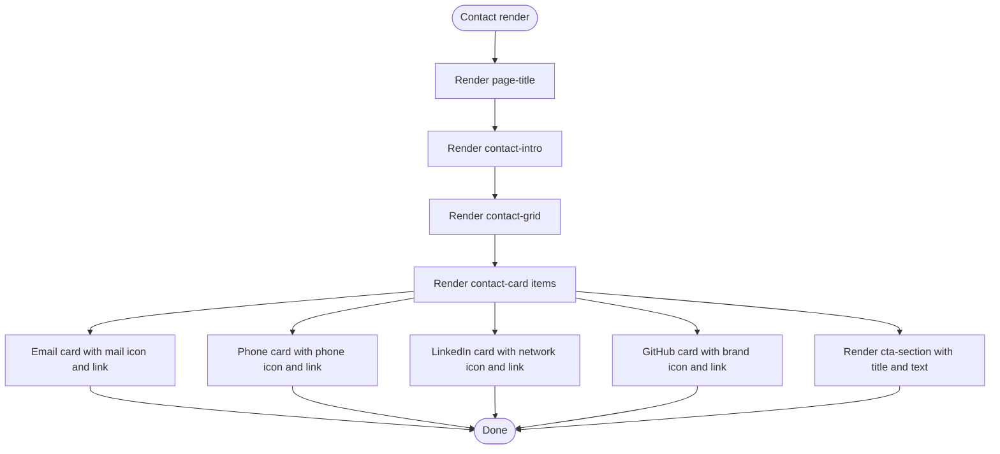
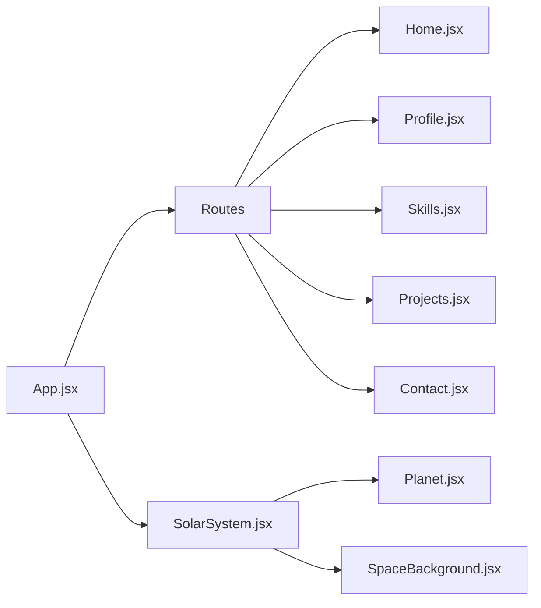

# Portfolio Pages

<cite>
**Referenced Files in This Document**
- [Home.jsx](file://src/pages/Home.jsx)
- [Home.css](file://src/pages/Home.css)
- [Profile.jsx](file://src/pages/Profile.jsx)
- [Profile.css](file://src/pages/Profile.css)
- [Skills.jsx](file://src/pages/Skills.jsx)
- [Skills.css](file://src/pages/Skills.css)
- [Projects.jsx](file://src/pages/Projects.jsx)
- [Projects.css](file://src/pages/Projects.css)
- [Contact.jsx](file://src/pages/Contact.jsx)
- [Contact.css](file://src/pages/Contact.css)
- [App.jsx](file://src/App.jsx)
- [main.jsx](file://src/main.jsx)
- [SolarSystem.jsx](file://src/components/SolarSystem.jsx)
- [Planet.jsx](file://src/components/Planet.jsx)
- [SpaceBackground.jsx](file://src/components/SpaceBackground.jsx)
- [App.css](file://src/App.css)
</cite>

## Table of Contents
1. [Introduction](#introduction)
2. [Project Structure](#project-structure)
3. [Core Components](#core-components)
4. [Architecture Overview](#architecture-overview)
5. [Detailed Component Analysis](#detailed-component-analysis)
6. [Dependency Analysis](#dependency-analysis)
7. [Performance Considerations](#performance-considerations)
8. [Troubleshooting Guide](#troubleshooting-guide)
9. [Conclusion](#conclusion)
10. [Appendices](#appendices)

## Introduction
This document explains the five portfolio pages that compose the application: Home, Profile, Skills, Projects, and Contact. It describes the content structure, styling approaches, and responsive design considerations for each page. It also provides guidance for updating content and maintaining consistency across pages.

## Project Structure
The application is a React single-page application using client-side routing. The main application container composes a starry background, a navigational Solar System, and the page content area. Each page is implemented as a separate component with its own CSS module.

**Diagram sources**
- [main.jsx](file://src/main.jsx#L1-L14)
- [App.jsx](file://src/App.jsx#L1-L35)
- [SpaceBackground.jsx](file://src/components/SpaceBackground.jsx#L1-L68)
- [SolarSystem.jsx](file://src/components/SolarSystem.jsx#L1-L60)
- [Home.jsx](file://src/pages/Home.jsx#L1-L26)
- [Profile.jsx](file://src/pages/Profile.jsx#L1-L54)
- [Skills.jsx](file://src/pages/Skills.jsx#L1-L52)
- [Projects.jsx](file://src/pages/Projects.jsx#L1-L66)
- [Contact.jsx](file://src/pages/Contact.jsx#L1-L74)

**Section sources**
- [main.jsx](file://src/main.jsx#L1-L14)
- [App.jsx](file://src/App.jsx#L1-L35)
- [App.css](file://src/App.css#L1-L26)

## Core Components
- Home page: Hero section welcoming visitors and introducing the AI theme.
- Profile page: Personal narrative, education, experience, and interests organized in a responsive grid.
- Skills page: Categorized technology skills with animated dots and hover effects.
- Projects page: Project cards with descriptions and technology badges.
- Contact page: Contact cards with icons, links, and a call-to-action section.

Each page follows a consistent layout pattern:
- A page container centered with a max width.
- A content card with backdrop blur, rounded corners, borders, and subtle shadows.
- Typography hierarchy with consistent colors and spacing.
- Responsive adjustments via media queries for smaller screens.

**Section sources**
- [Home.jsx](file://src/pages/Home.jsx#L1-L26)
- [Home.css](file://src/pages/Home.css#L1-L68)
- [Profile.jsx](file://src/pages/Profile.jsx#L1-L54)
- [Profile.css](file://src/pages/Profile.css#L1-L76)
- [Skills.jsx](file://src/pages/Skills.jsx#L1-L52)
- [Skills.css](file://src/pages/Skills.css#L1-L89)
- [Projects.jsx](file://src/pages/Projects.jsx#L1-L66)
- [Projects.css](file://src/pages/Projects.css#L1-L91)
- [Contact.jsx](file://src/pages/Contact.jsx#L1-L74)
- [Contact.css](file://src/pages/Contact.css#L1-L140)

## Architecture Overview
The navigation system is a Solar System metaphor: a central Sun (with user info and avatar) and five Orbiting Planets representing the five pages. Clicking a planet navigates to the corresponding route. The page content is layered above the background and navigation.

**Diagram sources**
- [Planet.jsx](file://src/components/Planet.jsx#L1-L34)
- [SolarSystem.jsx](file://src/components/SolarSystem.jsx#L1-L60)
- [App.jsx](file://src/App.jsx#L1-L35)

**Section sources**
- [SolarSystem.jsx](file://src/components/SolarSystem.jsx#L1-L60)
- [Planet.jsx](file://src/components/Planet.jsx#L1-L34)
- [App.jsx](file://src/App.jsx#L1-L35)

## Detailed Component Analysis

### Home Page
- Structure
  - A centered hero section with a gradient title, subtitle, and descriptive paragraph.
  - Uses a shared page container and content card for consistent styling.
- Styling
  - Large, bold hero title with gradient text.
  - Subtle subtitle and readable description with constrained max-width.
  - Backdrop blur and glass-morphism card with border and shadow.
- Responsiveness
  - Font sizes scale down on small screens; padding adjusts for mobile.

**Diagram sources**
- [Home.jsx](file://src/pages/Home.jsx#L1-L26)
- [Home.css](file://src/pages/Home.css#L1-L68)

**Section sources**
- [Home.jsx](file://src/pages/Home.jsx#L1-L26)
- [Home.css](file://src/pages/Home.css#L1-L68)

### Profile Page
- Structure
  - Page title followed by a responsive grid of profile sections.
  - Sections include “Who I Am,” “Education,” “Experience,” and “Interests.”
- Styling
  - Grid with auto-fit columns and minimum widths for responsiveness.
  - Hover animations lift cards and add glow-like shadows.
  - Consistent typography hierarchy with accent colors for section titles.
- Responsiveness
  - On small screens, grid becomes a single column with reduced spacing.

**Diagram sources**
- [Profile.jsx](file://src/pages/Profile.jsx#L1-L54)
- [Profile.css](file://src/pages/Profile.css#L1-L76)

**Section sources**
- [Profile.jsx](file://src/pages/Profile.jsx#L1-L54)
- [Profile.css](file://src/pages/Profile.css#L1-L76)

### Skills Page
- Structure
  - Static categories (Frontend, Backend, Database, DevOps & Tools) with lists of technologies.
  - Each category is rendered as a card with a title and a vertical list of skills.
- Styling
  - Category cards with hover elevation and colored borders.
  - Skill items include a glowing dot and a skill name label.
  - Smooth transitions for interactive states.
- Responsiveness
  - Grid collapses to single column on small screens; padding and font sizes adjust.

**Diagram sources**
- [Skills.jsx](file://src/pages/Skills.jsx#L1-L52)
- [Skills.css](file://src/pages/Skills.css#L1-L89)

**Section sources**
- [Skills.jsx](file://src/pages/Skills.jsx#L1-L52)
- [Skills.css](file://src/pages/Skills.css#L1-L89)

### Projects Page
- Structure
  - Array of projects with title, description, and technology stack.
  - Each project renders as a card with a header, description, and technology badges.
- Styling
  - Cards arranged in a responsive grid with hover elevation and colored borders.
  - Technology badges styled with gradient backgrounds and rounded corners.
- Responsiveness
  - Grid adapts to screen size; font sizes and paddings reduce on small screens.

**Diagram sources**
- [Projects.jsx](file://src/pages/Projects.jsx#L1-L66)
- [Projects.css](file://src/pages/Projects.css#L1-L91)

**Section sources**
- [Projects.jsx](file://src/pages/Projects.jsx#L1-L66)
- [Projects.css](file://src/pages/Projects.css#L1-L91)

### Contact Page
- Structure
  - Contact cards for Email, Phone, LinkedIn, and GitHub with icons and links.
  - A call-to-action section below the cards.
- Styling
  - Cards with hover lift and purple-tinted glow; icons sized and colored consistently.
  - Links styled with hover effects and word wrapping for long URLs.
  - CTA section with soft purple tint and centered content.
- Responsiveness
  - Grid becomes single column on small screens; icon sizes and paddings adapt.

**Diagram sources**
- [Contact.jsx](file://src/pages/Contact.jsx#L1-L74)
- [Contact.css](file://src/pages/Contact.css#L1-L140)

**Section sources**
- [Contact.jsx](file://src/pages/Contact.jsx#L1-L74)
- [Contact.css](file://src/pages/Contact.css#L1-L140)

## Dependency Analysis
- Routing
  - The application uses react-router-dom to define routes for each page.
- Navigation
  - SolarSystem.jsx defines the five destinations and passes props to Planet.jsx.
  - Planet.jsx triggers navigation on click.
- Styling
  - Each page has its own CSS module for scoped styles.
  - App.css manages global layout and z-index for layered content.

**Diagram sources**
- [App.jsx](file://src/App.jsx#L1-L35)
- [SolarSystem.jsx](file://src/components/SolarSystem.jsx#L1-L60)
- [Planet.jsx](file://src/components/Planet.jsx#L1-L34)
- [SpaceBackground.jsx](file://src/components/SpaceBackground.jsx#L1-L68)
- [Home.jsx](file://src/pages/Home.jsx#L1-L26)
- [Profile.jsx](file://src/pages/Profile.jsx#L1-L54)
- [Skills.jsx](file://src/pages/Skills.jsx#L1-L52)
- [Projects.jsx](file://src/pages/Projects.jsx#L1-L66)
- [Contact.jsx](file://src/pages/Contact.jsx#L1-L74)

**Section sources**
- [App.jsx](file://src/App.jsx#L1-L35)
- [SolarSystem.jsx](file://src/components/SolarSystem.jsx#L1-L60)
- [Planet.jsx](file://src/components/Planet.jsx#L1-L34)
- [SpaceBackground.jsx](file://src/components/SpaceBackground.jsx#L1-L68)

## Performance Considerations
- Canvas background
  - The starfield uses a canvas with requestAnimationFrame. It resizes with the window and cleans up listeners on unmount.
- Navigation
  - Planet animations are pure CSS keyframes; clicking triggers lightweight navigation.
- Rendering
  - Each page is a functional component with minimal state; lists are static arrays, avoiding unnecessary re-renders.

[No sources needed since this section provides general guidance]

## Troubleshooting Guide
- Navigation not working
  - Ensure react-router-dom is installed and BrowserRouter wraps the app.
  - Verify route paths match the Planet path props.
- Solar System visuals
  - Confirm the profile image fallback logic handles missing assets gracefully.
- Responsive issues
  - Check media queries in each page’s CSS and the global content padding in App.css.
- Links and icons
  - Validate SVG icons and external links in the Contact page.

**Section sources**
- [main.jsx](file://src/main.jsx#L1-L14)
- [App.jsx](file://src/App.jsx#L1-L35)
- [SolarSystem.jsx](file://src/components/SolarSystem.jsx#L1-L60)
- [SpaceBackground.jsx](file://src/components/SpaceBackground.jsx#L1-L68)
- [Contact.jsx](file://src/pages/Contact.jsx#L1-L74)

## Conclusion
The portfolio pages share a cohesive design language and responsive layout. The Solar System navigation offers an immersive way to move between sections, while each page focuses on its content area with consistent typography, spacing, and interactive states. Updating content involves editing the respective JSX arrays or text nodes and adjusting CSS for minor tweaks.

[No sources needed since this section summarizes without analyzing specific files]

## Appendices

### Content Update Guidelines
- Home
  - Modify the hero title, subtitle, and description inside the Home component.
  - Adjust spacing and font sizes in Home.css if needed.
- Profile
  - Edit the profile-grid content blocks in Profile.jsx.
  - Keep the grid structure intact for responsive behavior.
- Skills
  - Add or remove categories and skills in the skillCategories array.
  - Maintain the card and list structure for consistent styling.
- Projects
  - Add or edit entries in the projects array.
  - Keep the project-card layout and tech badge styling.
- Contact
  - Update links and labels in Contact.jsx.
  - Maintain the contact-grid and card layout for responsiveness.

### Consistency Checklist
- Typography
  - Use the established page-title, section-title, and text classes.
- Spacing
  - Apply page-container and page-content consistently.
- Colors and Shadows
  - Use the existing color accents and hover states.
- Responsiveness
  - Test on small screens after making changes.

[No sources needed since this section provides general guidance]