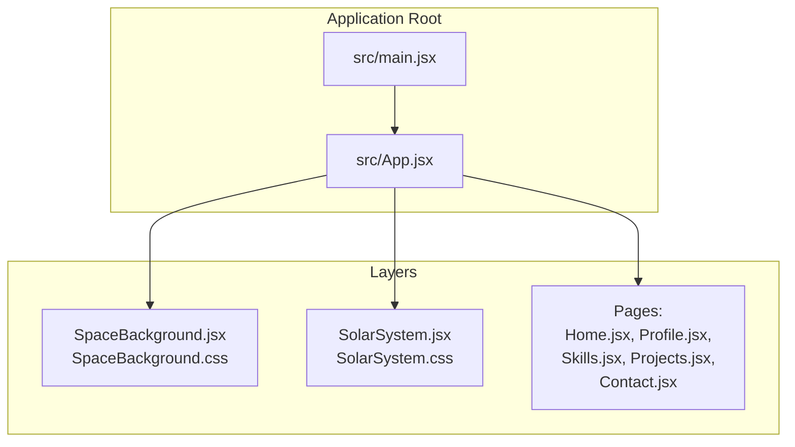
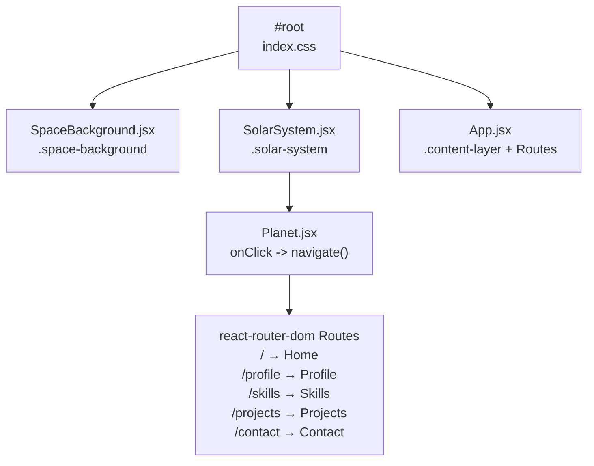
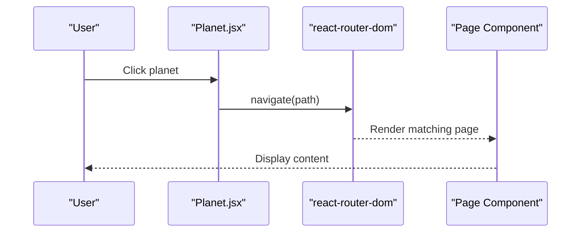
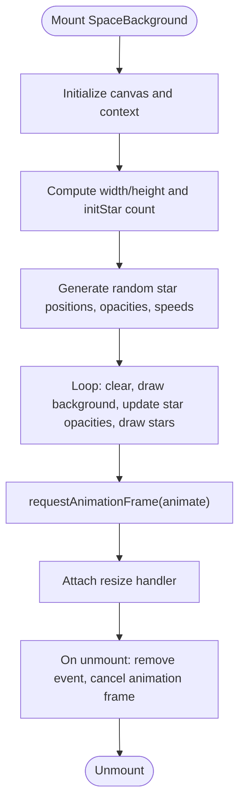
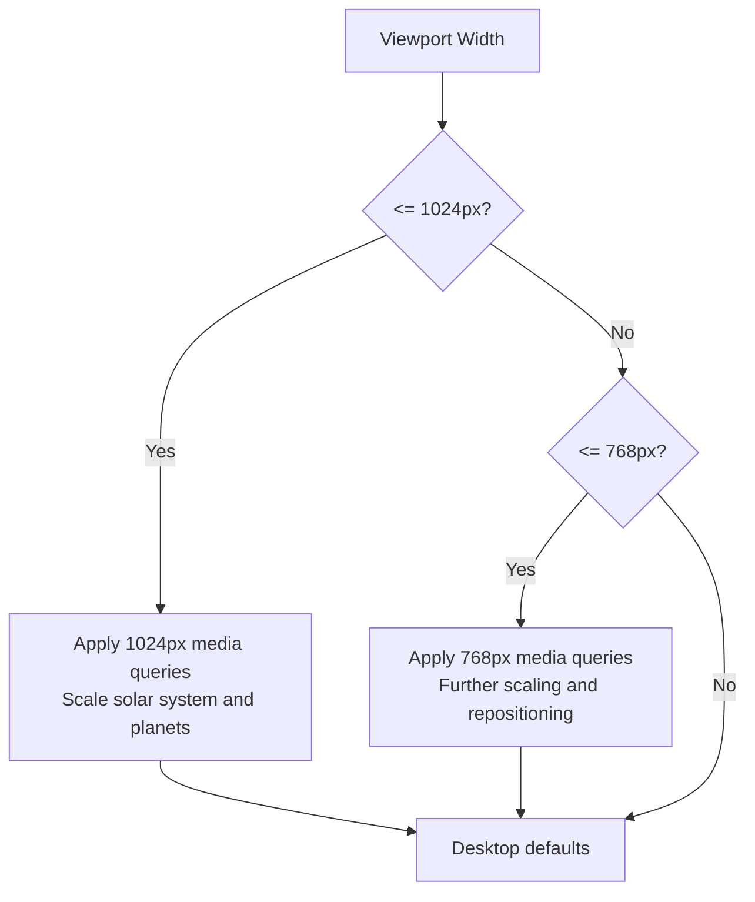
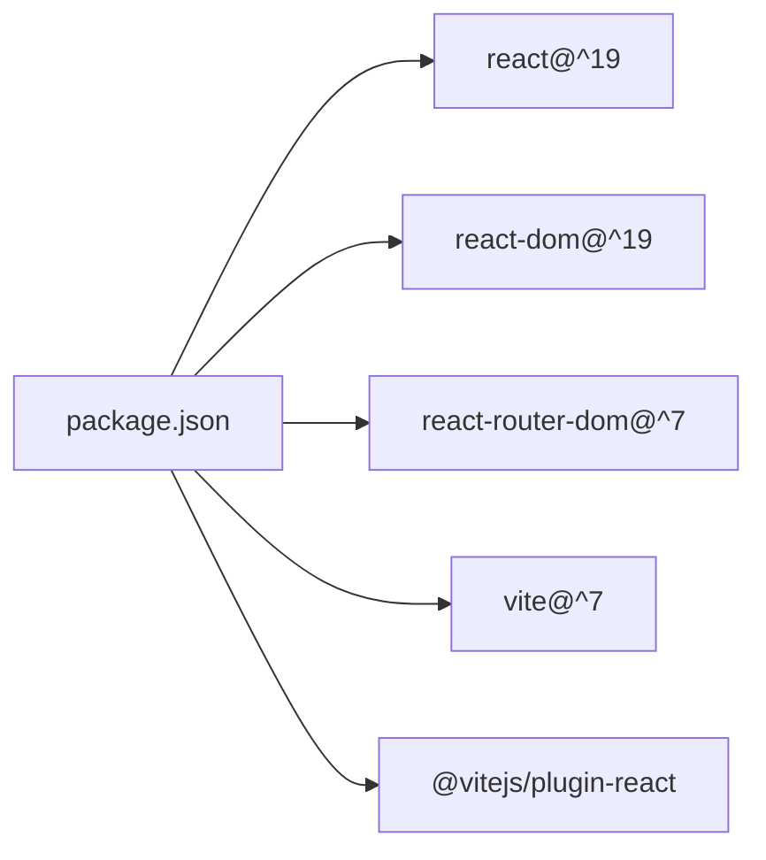

# Project Overview

<cite>
**Referenced Files in This Document**
- [README.md](file://README.md)
- [package.json](file://package.json)
- [src/main.jsx](file://src/main.jsx)
- [src/App.jsx](file://src/App.jsx)
- [src/components/SolarSystem.jsx](file://src/components/SolarSystem.jsx)
- [src/components/Planet.jsx](file://src/components/Planet.jsx)
- [src/components/SpaceBackground.jsx](file://src/components/SpaceBackground.jsx)
- [src/components/SolarSystem.css](file://src/components/SolarSystem.css)
- [src/components/Planet.css](file://src/components/Planet.css)
- [src/components/SpaceBackground.css](file://src/components/SpaceBackground.css)
- [src/index.css](file://src/index.css)
- [src/pages/Home.jsx](file://src/pages/Home.jsx)
- [src/pages/Profile.jsx](file://src/pages/Profile.jsx)
- [src/pages/Skills.jsx](file://src/pages/Skills.jsx)
- [src/pages/Projects.jsx](file://src/pages/Projects.jsx)
- [src/pages/Contact.jsx](file://src/pages/Contact.jsx)
</cite>

## Table of Contents
1. [Introduction](#introduction)
2. [Project Structure](#project-structure)
3. [Core Components](#core-components)
4. [Architecture Overview](#architecture-overview)
5. [Detailed Component Analysis](#detailed-component-analysis)
6. [Dependency Analysis](#dependency-analysis)
7. [Performance Considerations](#performance-considerations)
8. [Troubleshooting Guide](#troubleshooting-guide)
9. [Conclusion](#conclusion)
10. [Appendices](#appendices)

## Introduction
The Solar System Portfolio is a visually immersive, production-ready personal portfolio website built with React, Vite, and React Router. Its unique concept presents a professional portfolio through an interactive solar system interface where the Sun represents the user (you) at the center, and each orbiting planet corresponds to a different portfolio section. This approach creates a memorable, cinematic experience that blends storytelling with navigation, while maintaining a clean, modern, and responsive design.

Key value propositions:
- Interactive Solar System Navigation: planets orbit the Sun and link to distinct portfolio sections.
- Smooth Animations: cinematic orbits and hover effects enhance engagement.
- Fully Responsive: optimized layouts for desktop and mobile.
- Premium Design: dark space theme with twinkling stars and glassmorphic content cards.
- Clean Code: organized folder structure with reusable components.

Target audience and use cases:
- Professionals seeking a distinctive online presence (developers, designers, engineers).
- Creative coders who want to showcase technical skills with an artistic flair.
- Recruiters and collaborators browsing interactive, narrative-driven portfolios.
- Personal branding scenarios where storytelling and interactivity are priorities.

**Section sources**
- [README.md](file://README.md#L1-L12)
- [README.md](file://README.md#L13-L19)

## Project Structure
The project follows a clear, layered architecture:
- Entry point initializes routing and mounts the app.
- App composes three primary layers: background, navigation (solar system), and content.
- Pages represent individual portfolio sections with dedicated styling.

**Diagram sources**
- [src/main.jsx](file://src/main.jsx#L1-L14)
- [src/App.jsx](file://src/App.jsx#L1-L35)
- [src/components/SpaceBackground.jsx](file://src/components/SpaceBackground.jsx#L1-L68)
- [src/components/SolarSystem.jsx](file://src/components/SolarSystem.jsx#L1-L60)
- [src/pages/Home.jsx](file://src/pages/Home.jsx#L1-L25)
- [src/pages/Profile.jsx](file://src/pages/Profile.jsx#L1-L54)
- [src/pages/Skills.jsx](file://src/pages/Skills.jsx#L1-L52)
- [src/pages/Projects.jsx](file://src/pages/Projects.jsx#L1-L66)
- [src/pages/Contact.jsx](file://src/pages/Contact.jsx#L1-L74)

**Section sources**
- [README.md](file://README.md#L70-L88)
- [src/main.jsx](file://src/main.jsx#L1-L14)
- [src/App.jsx](file://src/App.jsx#L1-L35)

## Core Components
- SpaceBackground: Renders a dynamic starfield using Canvas, with twinkling stars and responsive resizing.
- SolarSystem: Central composition containing the Sun and orbital paths; renders Planet components with unique colors, radii, and orbital durations.
- Planet: Individual navigable nodes that orbit per configuration and trigger route changes on click.
- Pages: Home, Profile, Skills, Projects, and Contact, each styled independently and rendered conditionally via routing.

Visual impact examples:
- The Sun’s glow and subtle pulsing draw attention and convey personality.
- Each Planet’s hover scale and label reveal add intuitive affordances.
- Glass-morphism and dark theme create depth and focus on content.

**Section sources**
- [src/components/SpaceBackground.jsx](file://src/components/SpaceBackground.jsx#L1-L68)
- [src/components/SolarSystem.jsx](file://src/components/SolarSystem.jsx#L1-L60)
- [src/components/Planet.jsx](file://src/components/Planet.jsx#L1-L34)
- [src/pages/Home.jsx](file://src/pages/Home.jsx#L1-L25)
- [src/pages/Profile.jsx](file://src/pages/Profile.jsx#L1-L54)
- [src/pages/Skills.jsx](file://src/pages/Skills.jsx#L1-L52)
- [src/pages/Projects.jsx](file://src/pages/Projects.jsx#L1-L66)
- [src/pages/Contact.jsx](file://src/pages/Contact.jsx#L1-L74)

## Architecture Overview
The app employs a layered rendering model:
- Background layer: Full-screen starfield drawn with Canvas.
- Navigation layer: Fixed-position solar system with clickable planets.
- Content layer: Route-based page content overlaying the navigation.

**Diagram sources**
- [src/index.css](file://src/index.css#L1-L40)
- [src/components/SpaceBackground.jsx](file://src/components/SpaceBackground.jsx#L1-L68)
- [src/components/SolarSystem.jsx](file://src/components/SolarSystem.jsx#L1-L60)
- [src/components/Planet.jsx](file://src/components/Planet.jsx#L1-L34)
- [src/App.jsx](file://src/App.jsx#L1-L35)

**Section sources**
- [src/App.jsx](file://src/App.jsx#L11-L32)
- [src/main.jsx](file://src/main.jsx#L7-L13)

## Detailed Component Analysis

### Solar System Navigation
The SolarSystem component defines the central “Sun” and five orbiting “Planets,” each mapped to a portfolio section. It computes orbital paths and passes navigation metadata to Planet.

**Diagram sources**
- [src/components/Planet.jsx](file://src/components/Planet.jsx#L7-L9)
- [src/App.jsx](file://src/App.jsx#L22-L28)

**Section sources**
- [src/components/SolarSystem.jsx](file://src/components/SolarSystem.jsx#L4-L11)
- [src/components/Planet.jsx](file://src/components/Planet.jsx#L4-L34)

### Space Background (Canvas Starfield)
SpaceBackground dynamically generates and animates stars, adapting to viewport size and canceling resources on unmount.

**Diagram sources**
- [src/components/SpaceBackground.jsx](file://src/components/SpaceBackground.jsx#L7-L62)

**Section sources**
- [src/components/SpaceBackground.jsx](file://src/components/SpaceBackground.jsx#L1-L68)
- [src/components/SpaceBackground.css](file://src/components/SpaceBackground.css#L1-L10)

### Responsive Design and Theming
Styling ensures the solar system remains visually coherent across breakpoints, with reduced sizes and adjusted label placements on smaller screens. The global theme emphasizes a dark space palette with subtle glows and glass-like content panels.

**Diagram sources**
- [src/components/SolarSystem.css](file://src/components/SolarSystem.css#L119-L179)
- [src/components/Planet.css](file://src/components/Planet.css#L62-L89)
- [src/index.css](file://src/index.css#L1-L40)

**Section sources**
- [src/components/SolarSystem.css](file://src/components/SolarSystem.css#L1-L180)
- [src/components/Planet.css](file://src/components/Planet.css#L1-L90)
- [src/index.css](file://src/index.css#L1-L40)

### Page Content Sections
Each page component encapsulates a distinct portfolio area with tailored layout and content.

- Home introduces the universe and invites exploration.
- Profile presents personal background, education, experience, and interests.
- Skills organizes technical proficiencies by category.
- Projects highlights featured work with technology tags.
- Contact provides multiple channels and a call-to-action.

**Section sources**
- [src/pages/Home.jsx](file://src/pages/Home.jsx#L1-L25)
- [src/pages/Profile.jsx](file://src/pages/Profile.jsx#L1-L54)
- [src/pages/Skills.jsx](file://src/pages/Skills.jsx#L1-L52)
- [src/pages/Projects.jsx](file://src/pages/Projects.jsx#L1-L66)
- [src/pages/Contact.jsx](file://src/pages/Contact.jsx#L1-L74)

## Dependency Analysis
External dependencies and their roles:
- React 19: UI framework.
- react-router-dom 7: Routing for page navigation.
- Vite 7: Build toolchain and dev server.
- Pure CSS: No external UI libraries; styling is self-contained.

**Diagram sources**
- [package.json](file://package.json#L15-L21)

**Section sources**
- [package.json](file://package.json#L1-L23)

## Performance Considerations
- Canvas starfield: Efficiently draws a number of stars proportional to screen area; cleanup on unmount prevents memory leaks.
- CSS animations: Hardware-accelerated transforms and opacity changes for smooth orbits and hover effects.
- Responsive scaling: Media queries reduce DOM and paint costs on lower-resolution devices.
- Route-based rendering: Only the active page is mounted, minimizing overhead.

Best practices:
- Keep star count proportional to viewport area to balance quality and performance.
- Prefer transform and opacity for animations to leverage GPU acceleration.
- Avoid unnecessary re-renders by passing stable props to Planet and SolarSystem.

**Section sources**
- [src/components/SpaceBackground.jsx](file://src/components/SpaceBackground.jsx#L19-L51)
- [src/components/Planet.css](file://src/components/Planet.css#L52-L59)
- [src/components/SolarSystem.css](file://src/components/SolarSystem.css#L107-L116)

## Troubleshooting Guide
Common issues and resolutions:
- Profile image fallback: If the profile asset is missing, a fallback SVG is used automatically.
- Canvas not updating on resize: Ensure resize handler is attached and animation frame is canceled on unmount.
- Navigation not working: Verify routes match Planet paths and that react-router-dom is properly wrapped around the app.
- Styles not applying: Confirm global index.css is loaded and component-specific CSS files are imported.

**Section sources**
- [src/components/SolarSystem.jsx](file://src/components/SolarSystem.jsx#L23-L27)
- [src/components/SpaceBackground.jsx](file://src/components/SpaceBackground.jsx#L56-L62)
- [src/main.jsx](file://src/main.jsx#L8-L12)
- [src/App.jsx](file://src/App.jsx#L22-L28)

## Conclusion
The Solar System Portfolio delivers a unique, immersive way to present a professional portfolio. By combining a narrative solar system metaphor with smooth animations, responsive design, and a premium dark theme, it offers both visual distinction and usability. The layered architecture keeps concerns separated, enabling easy customization and maintenance.

## Appendices
- Customization guide highlights editing personal info, adding a profile photo, and adjusting planet colors.
- Deployment targets include Vercel, Netlify, and GitHub Pages.

**Section sources**
- [README.md](file://README.md#L48-L68)
- [README.md](file://README.md#L90-L97)