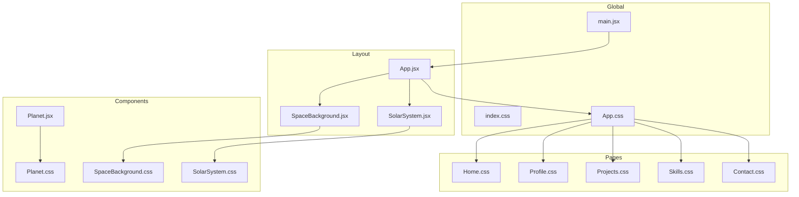
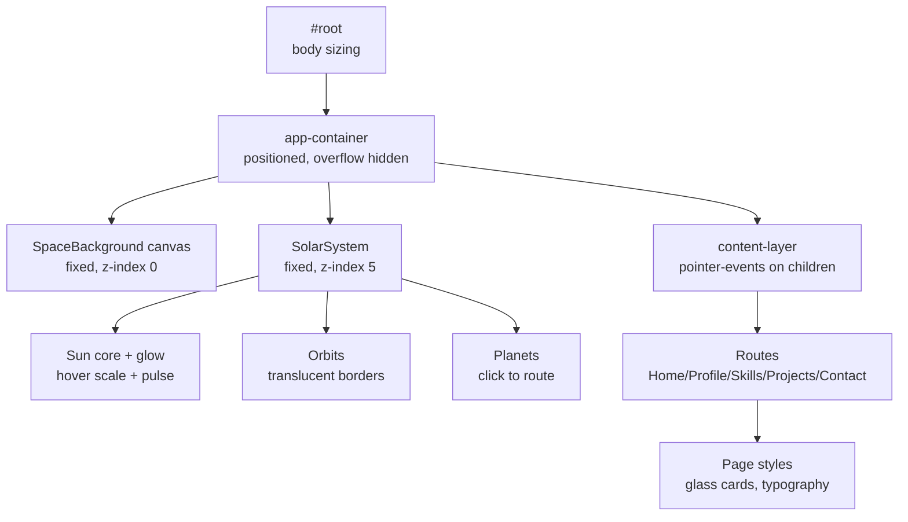
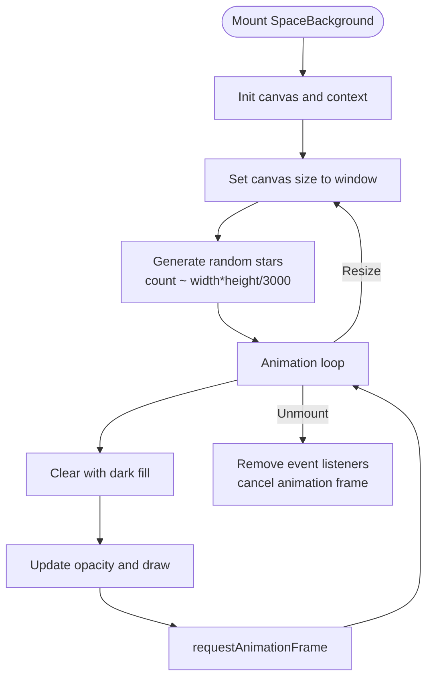
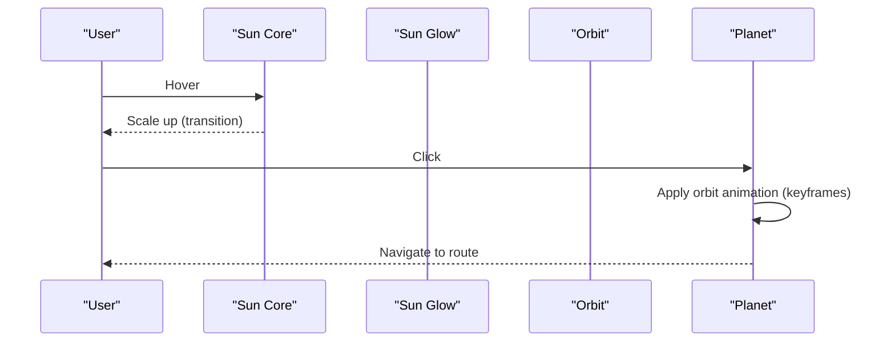
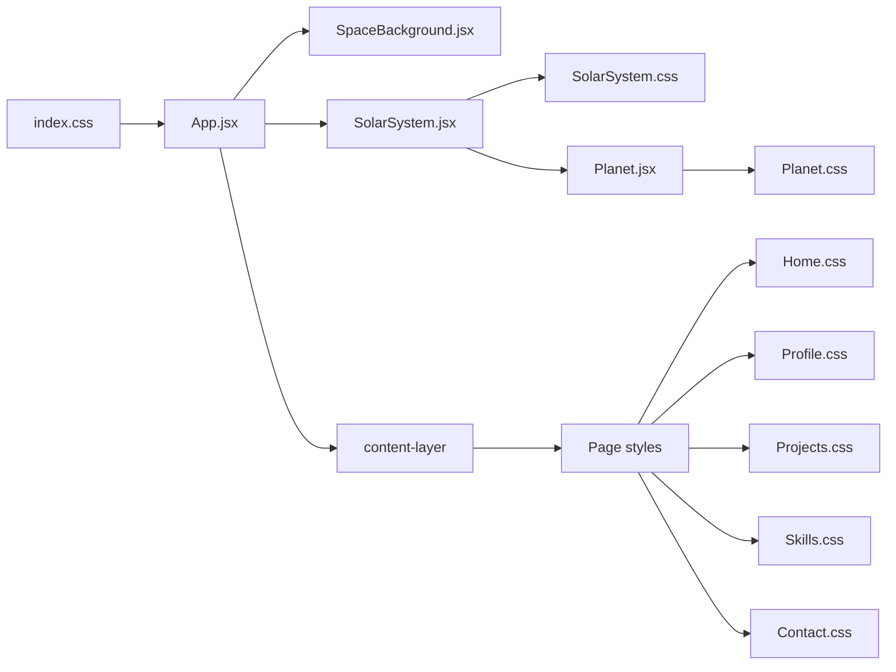

# Styling & Animation System

<cite>
**Referenced Files in This Document**
- [index.css](file://src/index.css)
- [App.css](file://src/App.css)
- [App.jsx](file://src/App.jsx)
- [main.jsx](file://src/main.jsx)
- [SpaceBackground.jsx](file://src/components/SpaceBackground.jsx)
- [SpaceBackground.css](file://src/components/SpaceBackground.css)
- [SolarSystem.jsx](file://src/components/SolarSystem.jsx)
- [SolarSystem.css](file://src/components/SolarSystem.css)
- [Planet.jsx](file://src/components/Planet.jsx)
- [Planet.css](file://src/components/Planet.css)
- [Home.css](file://src/pages/Home.css)
- [Profile.css](file://src/pages/Profile.css)
- [Projects.css](file://src/pages/Projects.css)
- [Skills.css](file://src/pages/Skills.css)
- [Contact.css](file://src/pages/Contact.css)
</cite>

## Table of Contents
1. [Introduction](#introduction)
2. [Project Structure](#project-structure)
3. [Core Components](#core-components)
4. [Architecture Overview](#architecture-overview)
5. [Detailed Component Analysis](#detailed-component-analysis)
6. [Dependency Analysis](#dependency-analysis)
7. [Performance Considerations](#performance-considerations)
8. [Troubleshooting Guide](#troubleshooting-guide)
9. [Conclusion](#conclusion)
10. [Appendices](#appendices)

## Introduction
This document explains the Solar System Portfolio’s visual system with a focus on CSS architecture, dark space theme implementation, glassmorphic card designs, responsive strategy, and animation systems. It covers how global styles, component-specific styles, and page-level styles collaborate, how CSS variables and keyframes power animations, and how the canvas-based star field creates immersive visuals. It also provides guidelines for maintaining visual consistency and extending the styling system.

## Project Structure
The styling system is organized around:
- Global baseline styles and scrollbars
- Application container and content layering
- Space background canvas and solar system navigation
- Component-specific styles for planets and orbits
- Page-level styles for glassmorphic cards and typography

**Diagram sources**
- [main.jsx](file://src/main.jsx#L1-L14)
- [App.jsx](file://src/App.jsx#L1-L35)
- [SpaceBackground.jsx](file://src/components/SpaceBackground.jsx#L1-L68)
- [SolarSystem.jsx](file://src/components/SolarSystem.jsx#L1-L60)
- [Planet.jsx](file://src/components/Planet.jsx#L1-L34)
- [index.css](file://src/index.css#L1-L40)
- [App.css](file://src/App.css#L1-L26)
- [SolarSystem.css](file://src/components/SolarSystem.css#L1-L180)
- [Planet.css](file://src/components/Planet.css#L1-L90)
- [SpaceBackground.css](file://src/components/SpaceBackground.css#L1-L10)
- [Home.css](file://src/pages/Home.css#L1-L68)
- [Profile.css](file://src/pages/Profile.css#L1-L76)
- [Projects.css](file://src/pages/Projects.css#L1-L91)
- [Skills.css](file://src/pages/Skills.css#L1-L89)
- [Contact.css](file://src/pages/Contact.css#L1-L140)

**Section sources**
- [index.css](file://src/index.css#L1-L40)
- [App.css](file://src/App.css#L1-L26)
- [App.jsx](file://src/App.jsx#L1-L35)
- [main.jsx](file://src/main.jsx#L1-L14)

## Core Components
- Global baseline and scrollbar styling
- App container and layered content model
- Space background canvas with twinkling stars
- Solar system with animated orbits and interactive sun
- Glassmorphic cards across pages with subtle hover animations

Key implementation highlights:
- Dark space theme with radial gradients and low-contrast typography
- Glassmorphism via backdrop filters, borders, and translucent backgrounds
- Responsive scaling of the solar system and UI elements
- CSS keyframes for pulsating sun and orbital motion
- Canvas-based star field with dynamic opacity modulation

**Section sources**
- [index.css](file://src/index.css#L1-L40)
- [App.css](file://src/App.css#L1-L26)
- [SpaceBackground.jsx](file://src/components/SpaceBackground.jsx#L1-L68)
- [SolarSystem.css](file://src/components/SolarSystem.css#L1-L180)
- [Planet.css](file://src/components/Planet.css#L1-L90)
- [Home.css](file://src/pages/Home.css#L1-L68)
- [Profile.css](file://src/pages/Profile.css#L1-L76)
- [Projects.css](file://src/pages/Projects.css#L1-L91)
- [Skills.css](file://src/pages/Skills.css#L1-L89)
- [Contact.css](file://src/pages/Contact.css#L1-L140)

## Architecture Overview
The visual architecture layers:
- Background: Fullscreen canvas star field
- Navigation: Fixed solar system with glowing sun and orbital planets
- Content: Scrollable page content with glass cards

**Diagram sources**
- [index.css](file://src/index.css#L17-L21)
- [App.css](file://src/App.css#L1-L26)
- [SpaceBackground.jsx](file://src/components/SpaceBackground.jsx#L64-L68)
- [SolarSystem.jsx](file://src/components/SolarSystem.jsx#L13-L56)
- [SolarSystem.css](file://src/components/SolarSystem.css#L1-L180)
- [Planet.jsx](file://src/components/Planet.jsx#L11-L31)
- [App.jsx](file://src/App.jsx#L11-L32)
- [Home.css](file://src/pages/Home.css#L7-L14)

## Detailed Component Analysis

### Global Styles and Theming
- Baseline reset and font stack for crisp rendering
- Root container sizing and overflow policies
- Scrollbar theming aligned with the dark palette
- Theme color tokens: dark blue/black gradients, translucent overlays, and soft glows

Guidelines:
- Keep body-level colors consistent with the space theme
- Use translucent overlays sparingly to preserve readability
- Maintain contrast ratios for accessibility

**Section sources**
- [index.css](file://src/index.css#L1-L40)

### App Container and Layering
- app-container ensures full viewport coverage and controlled overflow
- content-layer isolates page content from background/nav interactions
- Pointer events are disabled on the content layer and re-enabled on immediate children to allow routing interactions

Best practices:
- Keep z-index stacking explicit and minimal
- Avoid nested pointer-event overrides unless necessary

**Section sources**
- [App.css](file://src/App.css#L1-L26)
- [App.jsx](file://src/App.jsx#L21-L29)

### Space Background Canvas
- Fullscreen canvas draws a deep-space background and dynamically generates stars
- Stars twinkle using oscillating opacity with per-star speed and bounds
- Animation loop clears the canvas each frame and redraws stars
- Resize handler recalculates star count and positions based on viewport area

Performance notes:
- Star count scales with viewport area to maintain density
- requestAnimationFrame used for smooth animation
- Cleanup on unmount prevents memory leaks

**Diagram sources**
- [SpaceBackground.jsx](file://src/components/SpaceBackground.jsx#L7-L62)
- [SpaceBackground.css](file://src/components/SpaceBackground.css#L1-L10)

**Section sources**
- [SpaceBackground.jsx](file://src/components/SpaceBackground.jsx#L1-L68)
- [SpaceBackground.css](file://src/components/SpaceBackground.css#L1-L10)

### Solar System Navigation
- Fixed positioning centered on screen with z-index below page content
- Sun with radial glow and pulsing animation
- Planetary orbits rendered as translucent circles
- Planets animate along elliptical paths using CSS keyframes and custom properties

Responsive behavior:
- Solar system scales down across breakpoints
- Sun and planet sizes adjust proportionally
- Text sizes and layout shift gently for mobile

**Diagram sources**
- [SolarSystem.css](file://src/components/SolarSystem.css#L107-L116)
- [Planet.css](file://src/components/Planet.css#L52-L59)
- [SolarSystem.jsx](file://src/components/SolarSystem.jsx#L37-L54)
- [Planet.jsx](file://src/components/Planet.jsx#L14-L17)

**Section sources**
- [SolarSystem.jsx](file://src/components/SolarSystem.jsx#L1-L60)
- [SolarSystem.css](file://src/components/SolarSystem.css#L1-L180)
- [Planet.jsx](file://src/components/Planet.jsx#L1-L34)
- [Planet.css](file://src/components/Planet.css#L1-L90)

### Glassmorphic Cards and Typography
- Pages use translucent backgrounds with backdrop blur and thin borders
- Cards lift slightly on hover with subtle shadows and border color transitions
- Typography scales responsively with reduced line heights for compact screens
- Gradient accents and soft shadows reinforce depth without overwhelming content

Consistency tips:
- Reuse background and border tokens across cards
- Keep label colors readable against blurred backgrounds
- Prefer relative units for scalable layouts

**Section sources**
- [Home.css](file://src/pages/Home.css#L7-L14)
- [Profile.css](file://src/pages/Profile.css#L15-L21)
- [Projects.css](file://src/pages/Projects.css#L14-L19)
- [Skills.css](file://src/pages/Skills.css#L14-L19)
- [Contact.css](file://src/pages/Contact.css#L15-L26)

### Responsive Design Strategy
- Breakpoints at 1024px and 768px scale solar system and UI elements
- Typography adjusts font sizes and spacing for smaller screens
- Grid layouts switch to single-column on narrow widths
- Interactive elements increase hit areas on touch devices

Implementation anchors:
- Media queries in SolarSystem.css and page styles
- Flexible grids and padding adjustments

**Section sources**
- [SolarSystem.css](file://src/components/SolarSystem.css#L118-L179)
- [Planet.css](file://src/components/Planet.css#L61-L89)
- [Home.css](file://src/pages/Home.css#L47-L67)
- [Profile.css](file://src/pages/Profile.css#L58-L75)
- [Projects.css](file://src/pages/Projects.css#L68-L90)
- [Skills.css](file://src/pages/Skills.css#L70-L88)
- [Contact.css](file://src/pages/Contact.css#L94-L139)

### Animation System
- Sun pulse: keyframe-driven scale and opacity modulation
- Orbital motion: CSS animation with custom property for radius
- Hover states: transitions for scale, shadow, and label appearance
- Canvas twinkling: per-frame opacity oscillation with boundary inversion

Optimization:
- Use transforms and opacity for GPU-accelerated animations
- Limit number of animated elements; leverage CSS variables for dynamic values
- Cancel animation frames on unmount

**Section sources**
- [SolarSystem.css](file://src/components/SolarSystem.css#L107-L116)
- [Planet.css](file://src/components/Planet.css#L52-L59)
- [Planet.css](file://src/components/Planet.css#L22-L30)
- [SpaceBackground.jsx](file://src/components/SpaceBackground.jsx#L33-L48)

## Dependency Analysis
The styling system depends on:
- Global resets and fonts for consistent rendering
- App container for layering and pointer-event isolation
- Solar system and planet components for orbital and hover behaviors
- Page styles for card and typography consistency

**Diagram sources**
- [index.css](file://src/index.css#L1-L40)
- [App.jsx](file://src/App.jsx#L1-L35)
- [SpaceBackground.jsx](file://src/components/SpaceBackground.jsx#L1-L68)
- [SolarSystem.jsx](file://src/components/SolarSystem.jsx#L1-L60)
- [Planet.jsx](file://src/components/Planet.jsx#L1-L34)
- [SolarSystem.css](file://src/components/SolarSystem.css#L1-L180)
- [Planet.css](file://src/components/Planet.css#L1-L90)
- [Home.css](file://src/pages/Home.css#L1-L68)
- [Profile.css](file://src/pages/Profile.css#L1-L76)
- [Projects.css](file://src/pages/Projects.css#L1-L91)
- [Skills.css](file://src/pages/Skills.css#L1-L89)
- [Contact.css](file://src/pages/Contact.css#L1-L140)

**Section sources**
- [App.jsx](file://src/App.jsx#L1-L35)
- [SolarSystem.jsx](file://src/components/SolarSystem.jsx#L1-L60)
- [Planet.jsx](file://src/components/Planet.jsx#L1-L34)
- [SpaceBackground.jsx](file://src/components/SpaceBackground.jsx#L1-L68)

## Performance Considerations
- Prefer CSS transforms and opacity for animations; avoid layout-affecting properties
- Use requestAnimationFrame for canvas animations and clean up on unmount
- Control star count based on viewport area to balance fidelity and performance
- Minimize repaints by batching style updates and leveraging hardware acceleration
- Keep glass cards lightweight; avoid heavy backdrop filters on low-end devices

[No sources needed since this section provides general guidance]

## Troubleshooting Guide
Common issues and resolutions:
- Content not clickable behind navigation: ensure content-layer applies pointer-events only to direct children
- Solar system misalignment on resize: verify fixed positioning and transform centering
- Canvas not resizing: confirm resize handler updates width/height and reinitializes stars
- Overly heavy animations: reduce star count or opacity range; simplify keyframes

**Section sources**
- [App.css](file://src/App.css#L17-L19)
- [SolarSystem.jsx](file://src/components/SolarSystem.jsx#L13-L14)
- [SpaceBackground.jsx](file://src/components/SpaceBackground.jsx#L13-L17)
- [SpaceBackground.jsx](file://src/components/SpaceBackground.jsx#L56-L62)

## Conclusion
The Solar System Portfolio’s styling system blends a cohesive dark space theme with modern glassmorphic design and smooth animations. Global resets and a layered layout provide a strong foundation, while component-specific styles and responsive media queries ensure adaptability. The canvas-based star field and CSS keyframes deliver immersive motion without sacrificing performance. Following the extension guidelines will help maintain consistency as new pages and components are added.

[No sources needed since this section summarizes without analyzing specific files]

## Appendices

### CSS Variable Usage and Theming Tokens
- Custom properties enable dynamic orbital radii and scalable sizes
- Color tokens are applied consistently across sun glow, planet shadows, and UI accents
- Backdrop blur and border transparency create depth while preserving readability

Recommendations:
- Centralize theme tokens in global CSS for easy updates
- Use custom properties for values that vary by breakpoint or component variant
- Prefer HSL/HSLA for accessible color adjustments

**Section sources**
- [Planet.jsx](file://src/components/Planet.jsx#L14-L17)
- [Planet.jsx](file://src/components/Planet.jsx#L22-L25)
- [SolarSystem.css](file://src/components/SolarSystem.css#L33-L35)
- [SolarSystem.css](file://src/components/SolarSystem.css#L44-L47)
- [SolarSystem.css](file://src/components/SolarSystem.css#L107-L116)

### Extending the Styling System
- Add new pages with glass cards following existing patterns
- Introduce new planets by adding entries to the planets array and mapping styles
- Extend responsive breakpoints by mirroring existing media queries
- Maintain a consistent naming scheme for classes and custom properties

**Section sources**
- [SolarSystem.jsx](file://src/components/SolarSystem.jsx#L4-L11)
- [SolarSystem.jsx](file://src/components/SolarSystem.jsx#L37-L54)
- [SolarSystem.css](file://src/components/SolarSystem.css#L118-L179)
- [Planet.css](file://src/components/Planet.css#L61-L89)