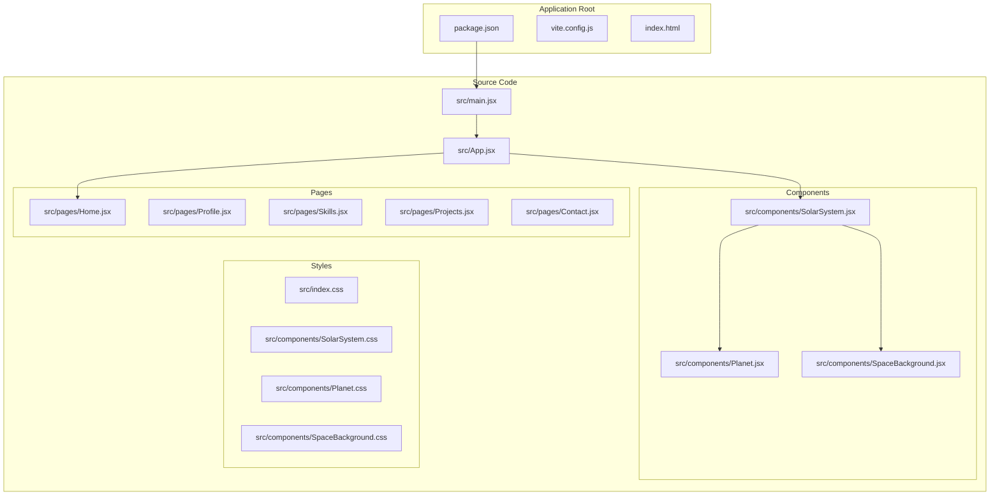
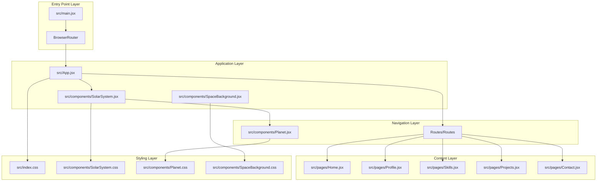
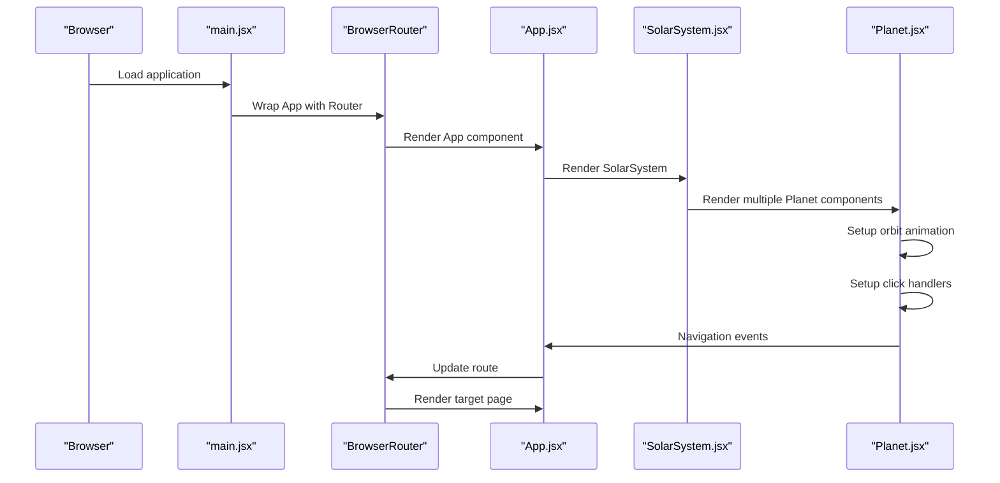
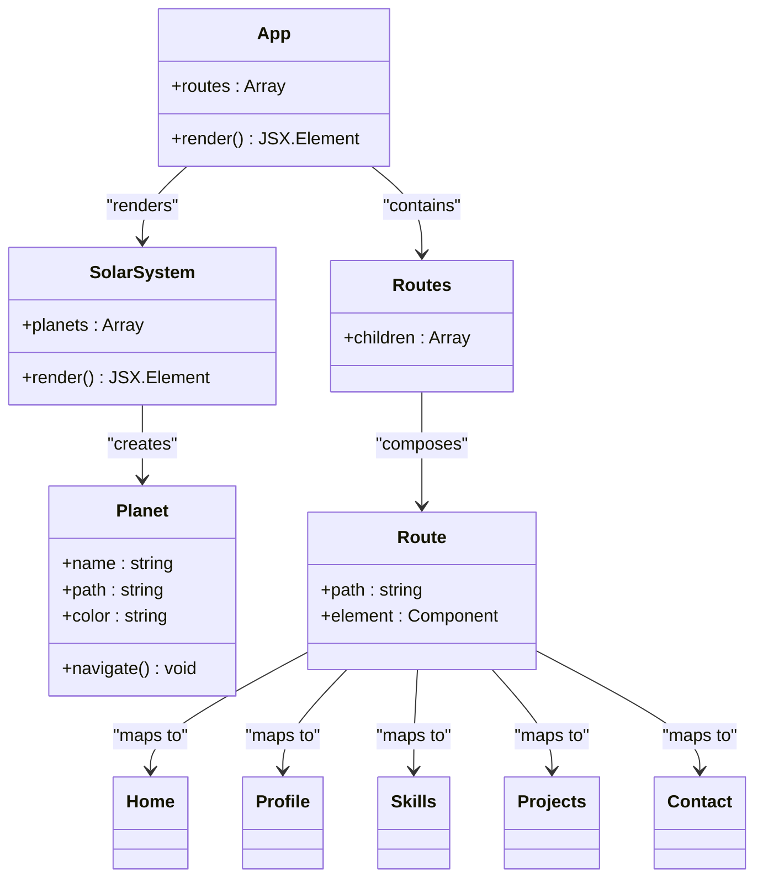
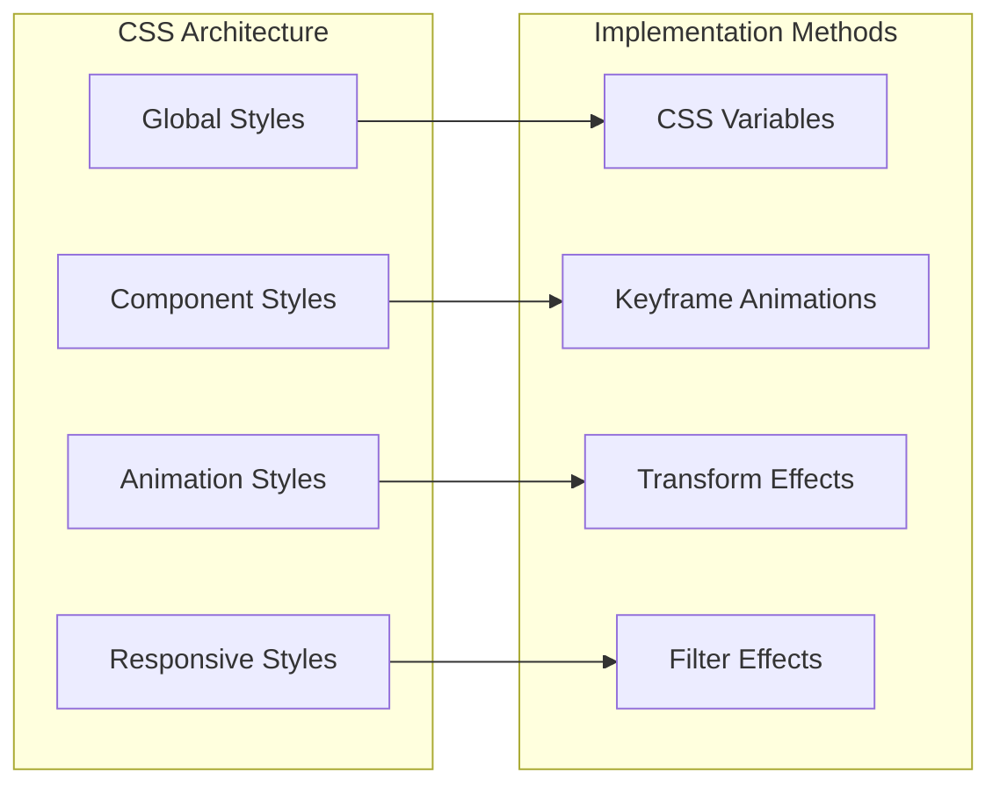

# Technology Stack

<cite>
**Referenced Files in This Document**
- [package.json](file://package.json)
- [vite.config.js](file://vite.config.js)
- [src/main.jsx](file://src/main.jsx)
- [src/App.jsx](file://src/App.jsx)
- [src/components/SolarSystem.jsx](file://src/components/SolarSystem.jsx)
- [src/components/Planet.jsx](file://src/components/Planet.jsx)
- [src/components/SolarSystem.css](file://src/components/SolarSystem.css)
- [src/components/Planet.css](file://src/components/Planet.css)
- [src/components/SpaceBackground.css](file://src/components/SpaceBackground.css)
- [src/index.css](file://src/index.css)
- [README.md](file://README.md)
- [vercel.json](file://vercel.json)
</cite>

## Table of Contents
1. [Introduction](#introduction)
2. [Project Structure](#project-structure)
3. [Core Technologies](#core-technologies)
4. [Architecture Overview](#architecture-overview)
5. [Technology Implementation Details](#technology-implementation-details)
6. [Development Tooling](#development-tooling)
7. [Performance Characteristics](#performance-characteristics)
8. [Browser Compatibility](#browser-compatibility)
9. [CSS Approach and Benefits](#css-approach-and-benefits)
10. [Version Compatibility and Upgrades](#version-compatibility-and-upgrades)
11. [Conclusion](#conclusion)

## Introduction

The Solar System Portfolio is a modern, interactive personal portfolio website built with cutting-edge web technologies. This project demonstrates a sophisticated approach to frontend development by combining React 19, Vite 7, and React Router DOM 7 to create an immersive, animated navigation experience themed around a solar system. The application features a unique interactive navigation system where the sun represents the user at the center, with planets orbiting around it representing different portfolio sections.

The project emphasizes a pure CSS approach without external libraries, showcasing how modern CSS capabilities can create complex animations and responsive designs without additional dependencies. This philosophy extends to the entire codebase, utilizing native browser APIs and modern JavaScript features for optimal performance and minimal bundle size.

## Project Structure

The project follows a clean, organized structure that separates concerns effectively:



**Diagram sources**
- [package.json](file://package.json#L1-L23)
- [vite.config.js](file://vite.config.js#L1-L8)
- [src/main.jsx](file://src/main.jsx#L1-L14)
- [src/App.jsx](file://src/App.jsx#L1-L35)

**Section sources**
- [README.md](file://README.md#L70-L88)
- [package.json](file://package.json#L1-L23)

## Core Technologies

### React 19.2.4

React serves as the primary framework for building the user interface components. The choice of React 19 reflects the latest stable release with significant performance improvements and new features designed for modern web applications.

Key React 19 features utilized in this project:
- **Automatic batching**: Improves rendering performance by automatically batching state updates
- **New hooks**: Enhanced hook capabilities for better component composition
- **Server components**: Optimized rendering for both client and server environments
- **Suspense improvements**: Better handling of asynchronous data fetching

### Vite 7.3.1

Vite provides the build tooling and development server, offering exceptional developer experience with near-instant cold starts and hot module replacement.

Vite-specific advantages in this project:
- **Fast development server**: Sub-second reload times during development
- **Optimized production builds**: Tree-shaking and code splitting for minimal bundle sizes
- **Native ESM support**: Leverages modern JavaScript module system
- **Plugin ecosystem**: Extensible architecture for custom transformations

### React Router DOM 7.13.0

React Router DOM enables client-side routing for the solar system navigation interface, allowing seamless transitions between portfolio sections without full page reloads.

Router capabilities utilized:
- **Declarative routing**: Clean route definitions in JSX
- **Programmatic navigation**: Programmatic route changes using hooks
- **Nested routing**: Hierarchical route organization
- **Route parameters**: Dynamic route handling for different sections

**Section sources**
- [README.md](file://README.md#L13-L18)
- [package.json](file://package.json#L15-L21)

## Architecture Overview

The application follows a layered architecture pattern with clear separation between presentation, routing, and styling concerns:



**Diagram sources**
- [src/main.jsx](file://src/main.jsx#L1-L14)
- [src/App.jsx](file://src/App.jsx#L1-L35)
- [src/components/SolarSystem.jsx](file://src/components/SolarSystem.jsx#L1-L60)
- [src/components/Planet.jsx](file://src/components/Planet.jsx#L1-L34)

The architecture emphasizes:
- **Component composition**: Reusable components with clear responsibilities
- **Layered styling**: Separation of global and component-specific styles
- **Declarative routing**: Clear navigation structure through React Router
- **Animation-first design**: CSS animations integrated throughout the component hierarchy

## Technology Implementation Details

### React 19 Implementation

The React 19 implementation focuses on modern patterns and performance optimization:



**Diagram sources**
- [src/main.jsx](file://src/main.jsx#L1-L14)
- [src/App.jsx](file://src/App.jsx#L1-L35)
- [src/components/SolarSystem.jsx](file://src/components/SolarSystem.jsx#L1-L60)
- [src/components/Planet.jsx](file://src/components/Planet.jsx#L1-L34)

### Vite Configuration

The Vite configuration is optimized for React development with minimal customization:

```mermaid
flowchart TD
Config[vite.config.js] --> Plugins[Plugin System]
Plugins --> ReactPlugin[@vitejs/plugin-react]
ReactPlugin --> Transform[JSX Transformation]
ReactPlugin --> HMR[Hot Module Replacement]
Config --> DevServer[Development Server]
DevServer --> FastReload[Near Instant Reloads]
DevServer --> LiveReload[Live Reloading]
Config --> Build[Production Build]
Build --> Bundle[Code Bundling]
Build --> Optimize[Tree Shaking]
Build --> Minify[Minification]
```

**Diagram sources**
- [vite.config.js](file://vite.config.js#L1-L8)
- [package.json](file://package.json#L15-L21)

### React Router Implementation

The routing system integrates seamlessly with the solar system theme:



**Diagram sources**
- [src/App.jsx](file://src/App.jsx#L1-L35)
- [src/components/SolarSystem.jsx](file://src/components/SolarSystem.jsx#L1-L60)
- [src/components/Planet.jsx](file://src/components/Planet.jsx#L1-L34)

**Section sources**
- [src/main.jsx](file://src/main.jsx#L1-L14)
- [src/App.jsx](file://src/App.jsx#L1-L35)
- [vite.config.js](file://vite.config.js#L1-L8)

## Development Tooling

### Build Scripts

The project utilizes standardized npm scripts for development workflows:

| Script | Purpose | Command |
|--------|---------|---------|
| `dev` | Start development server | `vite` |
| `build` | Create production build | `vite build` |
| `preview` | Preview production build locally | `vite preview` |

### Development Environment

The development setup emphasizes speed and developer experience:

- **Instant server startup**: Near-zero time to get the development server running
- **Hot Module Replacement**: Automatic updates without full page refreshes
- **TypeScript support**: Optional TypeScript integration for type safety
- **ESLint integration**: Code quality and consistency enforcement
- **Prettier formatting**: Consistent code formatting across the team

### Build Optimization

Production builds include several optimization strategies:

- **Tree shaking**: Elimination of unused code
- **Code splitting**: Automatic chunking for optimal loading
- **Asset optimization**: Compression and optimization of images and assets
- **Bundle analysis**: Tools for monitoring bundle size and composition

**Section sources**
- [package.json](file://package.json#L6-L10)
- [README.md](file://README.md#L20-L46)

## Performance Characteristics

### Rendering Performance

The application achieves excellent performance through several optimization strategies:

- **React 19 automatic batching**: Reduces unnecessary re-renders by batching state updates
- **CSS animations**: Hardware-accelerated animations for smooth 60fps performance
- **Lazy loading**: Components load only when needed
- **Efficient DOM manipulation**: Minimal DOM operations through React's virtual DOM

### Bundle Size Optimization

The pure CSS approach contributes significantly to performance:

- **Zero external dependencies**: No third-party CSS frameworks or libraries
- **Minimal JavaScript**: Focus on essential functionality with minimal overhead
- **Optimized CSS delivery**: Efficient CSS organization and loading
- **Image optimization**: Properly sized and compressed assets

### Memory Management

The application demonstrates efficient memory usage:

- **Component lifecycle management**: Proper cleanup of event listeners and timers
- **Animation performance**: Efficient use of CSS transforms and opacity
- **State management**: Minimal state updates to reduce memory footprint

## Browser Compatibility

### Supported Browsers

The application targets modern browsers with excellent compatibility:

| Browser | Version | Status |
|---------|---------|--------|
| Chrome | Latest | ✅ Fully supported |
| Firefox | Latest | ✅ Fully supported |
| Safari | Latest | ✅ Fully supported |
| Edge | Latest | ✅ Fully supported |

### Compatibility Features

The codebase includes several compatibility considerations:

- **Modern CSS features**: Flexbox, Grid, and transforms with appropriate fallbacks
- **JavaScript ES2020+**: Uses modern JavaScript features with transpilation
- **Responsive design**: Mobile-first approach with progressive enhancement
- **Accessibility**: Semantic HTML and ARIA attributes where appropriate

### Progressive Enhancement

The application follows progressive enhancement principles:

- **Basic functionality**: Core features work without JavaScript
- **Enhanced experience**: Rich animations and interactions with JavaScript enabled
- **Graceful degradation**: Features adapt gracefully when advanced features aren't available
- **Performance optimization**: Optimized for modern browsers while maintaining compatibility

**Section sources**
- [README.md](file://README.md#L98-L103)

## CSS Approach and Benefits

### Pure CSS Philosophy

The project embraces a pure CSS approach without external libraries, providing several strategic advantages:

#### Benefits of Pure CSS

- **Zero Dependencies**: No external CSS frameworks or libraries to manage
- **Performance**: Reduced bundle size and faster initial page loads
- **Control**: Complete control over styling without framework constraints
- **Customization**: Easy modification and extension of existing styles
- **Learning Opportunity**: Demonstrates modern CSS capabilities and best practices

#### CSS Implementation Strategies

The styling approach combines several modern CSS techniques:



**Diagram sources**
- [src/index.css](file://src/index.css#L1-L40)
- [src/components/SolarSystem.css](file://src/components/SolarSystem.css#L1-L180)
- [src/components/Planet.css](file://src/components/Planet.css#L1-L90)

#### Modern CSS Features Utilized

- **CSS Variables**: Dynamic theming and consistent color management
- **Flexbox**: Flexible layout systems for responsive design
- **Grid**: Complex layout arrangements with minimal code
- **Animations**: Hardware-accelerated CSS animations for smooth performance
- **Transforms**: 3D transforms and perspective effects
- **Filters**: Advanced visual effects without JavaScript
- **Backdrop filters**: Glassmorphism effects and modern UI techniques

### CSS Organization

The styling system follows a logical organization pattern:

- **Global styles**: Base styles and typography in index.css
- **Component-specific styles**: Isolated styling for individual components
- **Animation definitions**: Centralized animation keyframes
- **Responsive breakpoints**: Media queries integrated within component styles
- **Theme variables**: Consistent color schemes and spacing units

**Section sources**
- [README.md](file://README.md#L18)
- [src/index.css](file://src/index.css#L1-L40)
- [src/components/SolarSystem.css](file://src/components/SolarSystem.css#L1-L180)
- [src/components/Planet.css](file://src/components/Planet.css#L1-L90)

## Version Compatibility and Upgrades

### Current Version Matrix

| Technology | Current Version | Release Status | Notes |
|------------|----------------|----------------|-------|
| React | 19.2.4 | Latest Stable | Latest React with performance improvements |
| Vite | 7.3.1 | Latest Stable | Modern build tool with excellent DX |
| React Router DOM | 7.13.0 | Latest Stable | Comprehensive routing solution |
| @vitejs/plugin-react | 5.1.3 | Latest Stable | Official React plugin for Vite |

### Upgrade Considerations

#### React 19 Upgrade Path

Upgrading to newer React versions requires careful consideration:

- **Breaking Changes**: Review React 19 release notes for breaking changes
- **Performance Improvements**: Leverage automatic batching and new hooks
- **Testing**: Thorough testing of all components and interactions
- **Dependencies**: Ensure all React-related dependencies are compatible

#### Vite 7 Upgrade Path

Vite upgrades generally involve:

- **Plugin Updates**: Update @vitejs/plugin-react to latest version
- **Configuration Changes**: Review breaking changes in Vite configuration
- **Build Performance**: Monitor build performance after upgrades
- **Development Experience**: Test hot reload and development server performance

#### React Router DOM Upgrade Path

Router upgrades require attention to:

- **API Changes**: Review React Router 7 migration guide
- **Route Definitions**: Update any deprecated route patterns
- **Navigation Hooks**: Test programmatic navigation functionality
- **Nested Routes**: Verify nested routing continues to work correctly

### Compatibility Testing Strategy

When upgrading technologies, implement a comprehensive testing approach:

1. **Automated Tests**: Run existing test suites to catch regressions
2. **Manual Testing**: Test all interactive elements and animations
3. **Performance Profiling**: Measure performance impact of upgrades
4. **Browser Testing**: Verify compatibility across supported browsers
5. **Build Verification**: Ensure production builds complete successfully

### Maintenance Recommendations

- **Regular Updates**: Keep dependencies updated to benefit from security patches
- **Performance Monitoring**: Track bundle size and runtime performance
- **Compatibility Checks**: Regularly test against supported browsers
- **Documentation Updates**: Keep upgrade guides current with changes

**Section sources**
- [package.json](file://package.json#L15-L21)
- [README.md](file://README.md#L13-L18)

## Conclusion

The Solar System Portfolio demonstrates a mature approach to modern web development through its strategic technology choices and implementation patterns. The combination of React 19, Vite 7, and React Router DOM 7 creates a robust foundation for an interactive, performance-focused application.

The pure CSS approach showcases the capabilities of modern CSS while maintaining excellent performance characteristics and developer experience. This philosophy extends throughout the codebase, emphasizing simplicity, maintainability, and optimal user experience.

Key strengths of the technology stack include:
- **Excellent developer experience** through Vite's fast development server
- **Superior performance** via React 19's optimizations and pure CSS animations
- **Modern architecture** with clear separation of concerns
- **Future-proof design** with careful version management and upgrade strategies
- **Comprehensive browser support** with progressive enhancement principles

The project serves as an excellent example of how modern web technologies can be combined to create engaging, performant applications while maintaining simplicity and maintainability. The solar system theme provides an innovative user experience that demonstrates the creative possibilities when combining strong technical foundations with thoughtful design.